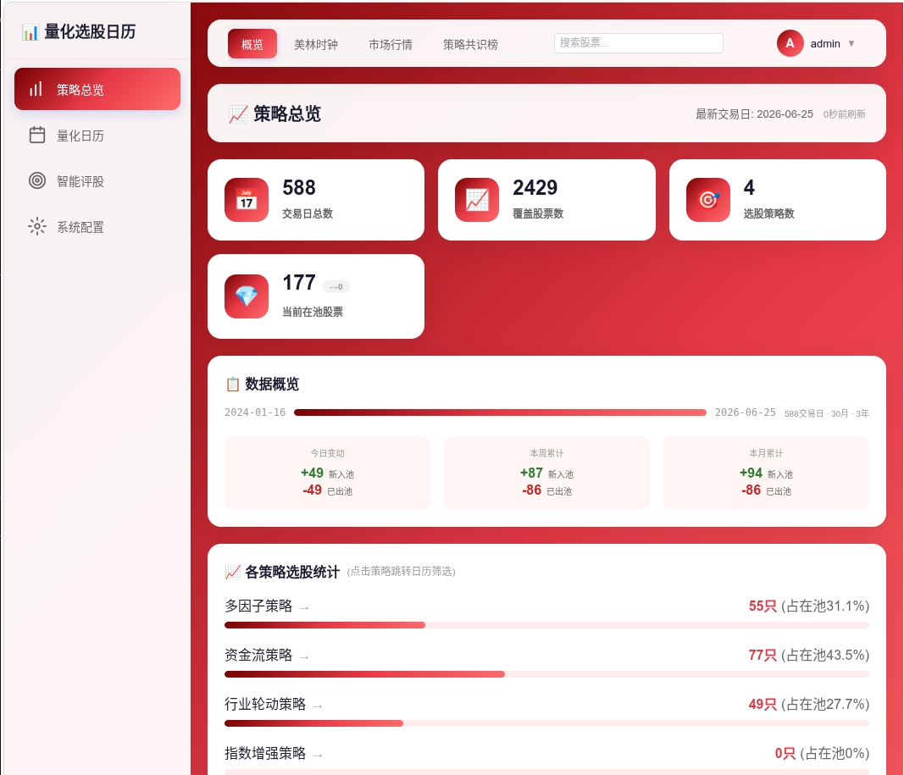
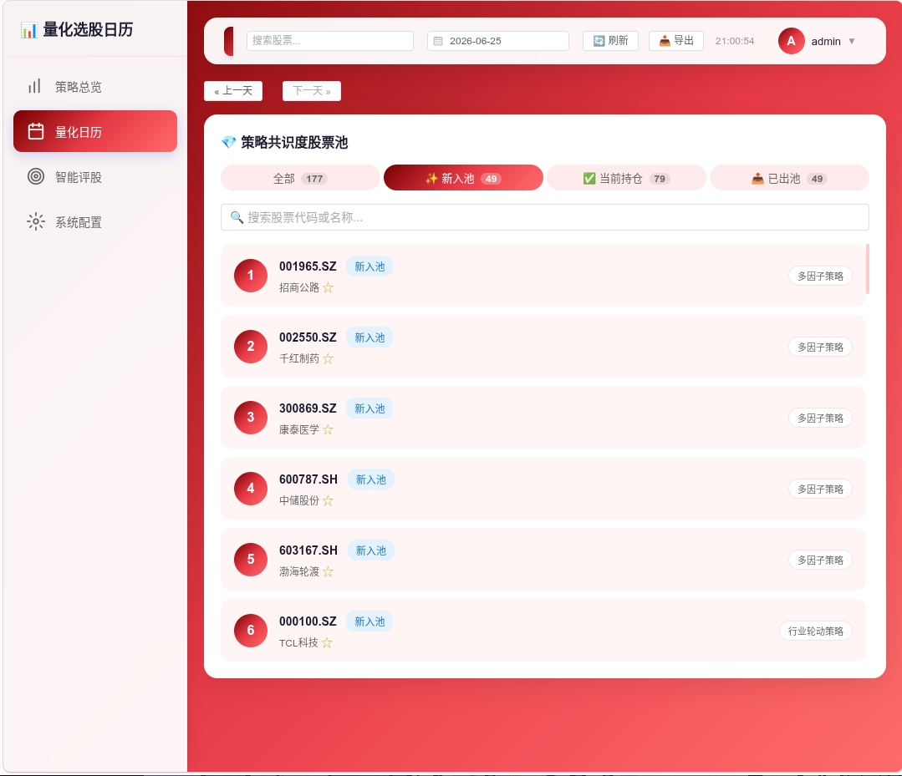
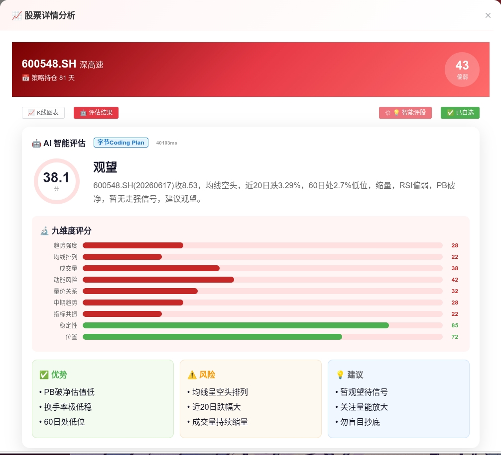
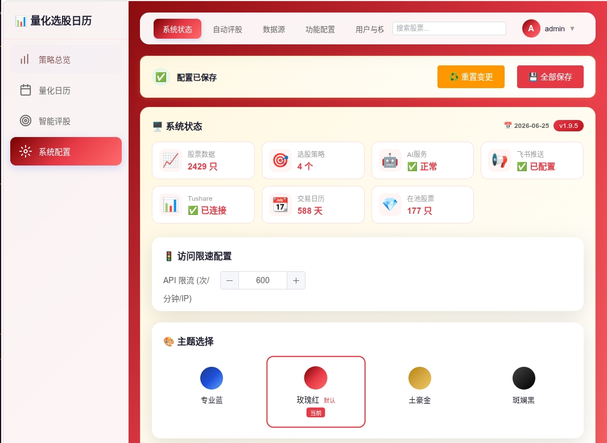

<p align="center">
  <h1 align="center">量化选股日历</h1>
  <p align="center">
    <strong>Quant Calendar</strong> — 宏观经济周期、多因子策略选股、AI 智能评估，整合到一个日历界面。
  </p>
  <p align="center">
    <a href="https://github.com/bangbang8000-cell/quant-calendar/releases"></a>
    <a href="LICENSE"></a>
    <a href="#"></a>
    <a href="#"></a>
    <a href="#"></a>
    <a href="#"></a>
    <a href="https://github.com/bangbang8000-cell/quant-calendar/stargazers"></a>
  </p>
</p>

---

## 这是什么

量化选股日历是一个面向 A 股的量化决策辅助工具，开源，本地运行。

它把三个环节串在一起：判断当前宏观经济周期、运行多套策略自动选股、用 AI 逐个评估股票。所有结果集中展示在一个日历界面上。

| 宏观经济周期 | 多策略选股 | AI 评估 |
|:--:|:--:|:--:|
| 美林时钟，五维度评分 | 动量 / 反转 / 质量 / 资金流 | DeepSeek / OpenAI / 豆包 |
| 自动判断复苏-过热-滞涨-衰退 | 4 套策略交叉验证，共识榜汇总 | 技术指标自动注入，多模型串行 |

---

## 界面预览

<details open>
<summary><b>策略总览</b> — 共识榜、股票池、入池/出池统计</summary>
<p align="center">
  
</p>
</details>

<details>
<summary><b>量化日历</b> — 日/周/月/年视图，内置 K 线</summary>
<p align="center">
  
</p>
</details>

<details>
<summary><b>AI 评估</b> — 多模型串行评股，历史追溯</summary>
<p align="center">
  
</p>
</details>

<details>
<summary><b>系统配置</b> — 数据源管理、飞书推送、AI 模型配置</summary>
<p align="center">
  
</p>
</details>

---

## 功能

| 模块 | 说明 |
|------|------|
| 美林时钟 | GDP/CPI/PMI/社融/利率五维度定量评分，四阶段自动切换，切换历史可追溯 |
| 策略选股 | 多因子、行业轮动、资金流、指数增强四套策略独立运行，共识榜交叉验证 |
| AI 评股 | 多模型串行评估，RSI/MACD/MA/KDJ 自动注入 prompt，支持 8+ 模型 |
| AI 智能问股 | 对话式股票分析，流式输出，融合技术面+基本面+策略面多维度分析 |
| 量化日历 | 日/周/月/年视图切换，内置 ECharts K 线图 + MA 均线 + 成交量 |
| 全局搜索 | 股票代码/名称模糊搜索，实时建议 |
| 数据导出 | 各视图数据一键导出 CSV |
| 飞书推送 | Webhook 定时推送每日选股报告 |
| 多用户 | 管理组/用户组/访客组，独立自选股和评估历史 |
| 主题 | 7 套主题 + 4 套图标系统 |
| 初始化向导 | 首次启动引导配置密码、AI Key、Tushare Token |
| 安全 | JWT + bcrypt + CSP + HSTS |

---

## 仓库结构

```
quant-calendar/
├── README.md
├── quant-calendar-ops/          ← 应用代码
│   ├── Dockerfile               ← Docker 镜像定义
│   ├── docker-entrypoint.sh     ← 容器入口脚本
│   ├── docker-compose.yml       ← Compose 编排
│   ├── backend/                 ← FastAPI 后端 (Python)
│   │   ├── main_new.py          ← 主入口
│   │   ├── merrill_clock.py     ← 美林时钟引擎
│   │   ├── ai_evaluator.py      ← AI 多模型评股
│   │   ├── data_sources.py      ← 多数据源管理 (sxsc/tushare/akshare)
│   │   ├── scheduler.py         ← 定时任务调度
│   │   └── api/v1/              ← REST API (搜索/日历/视图/评估/用户)
│   ├── frontend/                ← Vue 3 SPA
│   │   ├── index.html           ← 单文件应用
│   │   ├── js/                  ← JS 模块
│   │   └── lib/                 ← Element Plus / ECharts
│   └── tests/
└── qresult/                     ← 策略选股 CSV 数据
    ├── 多因子策略持仓.csv
    ├── 行业轮动策略持仓.csv
    ├── 资金流策略持仓文件.csv
    └── 指数增强策略持仓.csv
```

---

## 技术栈

| 层 | 技术 | 备注 |
|----|------|------|
| 后端 | FastAPI (Python 3.10+) | 异步，自带 OpenAPI 文档 |
| 前端 | Vue 3 + Element Plus + ECharts | 单文件 SPA，无需编译 |
| 认证 | JWT (python-jose) + bcrypt | 24h 过期，角色权限 |
| 数据源 | Tushare Pro / sxsc_tushare / akshare | 三源热备自动切换 |
| AI | OpenAI 兼容协议 | DeepSeek / 豆包 / 通义千问 / GPT / Claude / GLM / Moonshot |
| 推送 | 飞书 Webhook | 机器人消息推送 |
| 存储 | JSON 文件 | 无数据库依赖 |

---

## 快速开始

### Docker（推荐）

```bash
docker pull ghcr.io/bangbang8000-cell/quant-calendar:latest

docker run -d --name quant-calendar -p 8000:8000 \
  -v quant-calendar-data:/app/data \
  ghcr.io/bangbang8000-cell/quant-calendar:latest
```

浏览器打开 http://localhost:8000，登录后跟随初始化向导配置 Tushare Token 和 AI Key。

如需使用自己的策略数据：
```bash
docker run -d --name quant-calendar -p 8000:8000 \
  -v quant-calendar-data:/app/data \
  -v /path/to/your/qresult:/data/qresult:ro \
  ghcr.io/bangbang8000-cell/quant-calendar:latest
```

GitHub Actions 在推送版本标签时自动构建并推送镜像到 ghcr.io。

### 源码安装

环境要求：Python 3.10+，[Tushare Pro](https://tushare.pro/) 账号。

```bash
git clone https://github.com/bangbang8000-cell/quant-calendar.git
cd quant-calendar/quant-calendar-ops/backend

pip install -r requirements.txt

cp .env.example .env
# 编辑 .env，填入 TUSHARE_TOKEN=***
python main_new.py --port 8000
```

无需 MySQL、Redis、GPU。

### 默认账号

| 用户名 | 密码 | 角色 | 权限 |
|--------|------|------|------|
| `admin` | `admin` | 管理员 | 全部功能 + 系统配置 + 用户管理 |
| `guest` | `guest` | 访客 | 只读查看 |

首次登录后请修改 admin 密码。

---

## 路线图

- PostgreSQL 存储后端（可选替代 JSON）
- 策略回测收益归因可视化
- 移动端 PWA 离线支持
- 实时行情 WebSocket 推送
- 更多选股策略
- 更多 AI 模型集成

---

## 免责声明

本工具仅用于数据分析和研究参考，不构成任何投资建议。所有选股结果和 AI 评估结论均为基于历史数据的统计分析，不代表对未来收益的预测或保证。股市有风险，投资需谨慎。使用者应独立判断并自行承担投资风险。

---

## 贡献

欢迎提 Issue、PR。

贡献前可阅读 [DEPLOYMENT.md](quant-calendar-ops/DEPLOYMENT.md) 了解项目结构。新功能建议先开 Issue 讨论。PR 请确保不包含硬编码密钥。

---

## 许可

MIT License — 详见 [LICENSE](quant-calendar-ops/LICENSE)

---

## Star History

<a href="https://star-history.com/#bangbang8000-cell/quant-calendar&Date">
  <picture>
    <source media="(prefers-color-scheme: dark)" srcset="https://api.star-history.com/svg?repos=bangbang8000-cell/quant-calendar&type=Date&theme=dark" />
    <source media="(prefers-color-scheme: light)" srcset="https://api.star-history.com/svg?repos=bangbang8000-cell/quant-calendar&type=Date" />
    
  </picture>
</a>

---

<p align="center">
  <sub>Made with love for A-share quantitative investors</sub>
</p>
