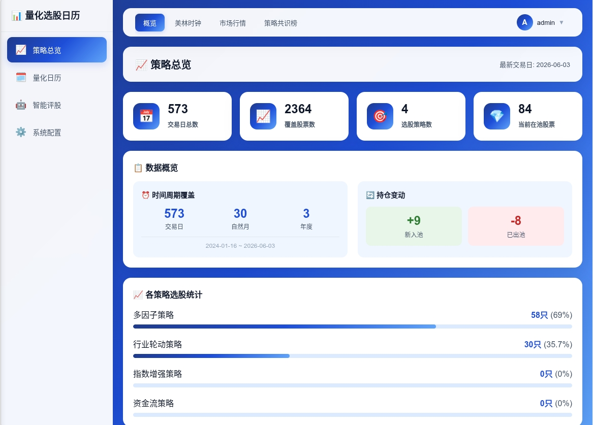
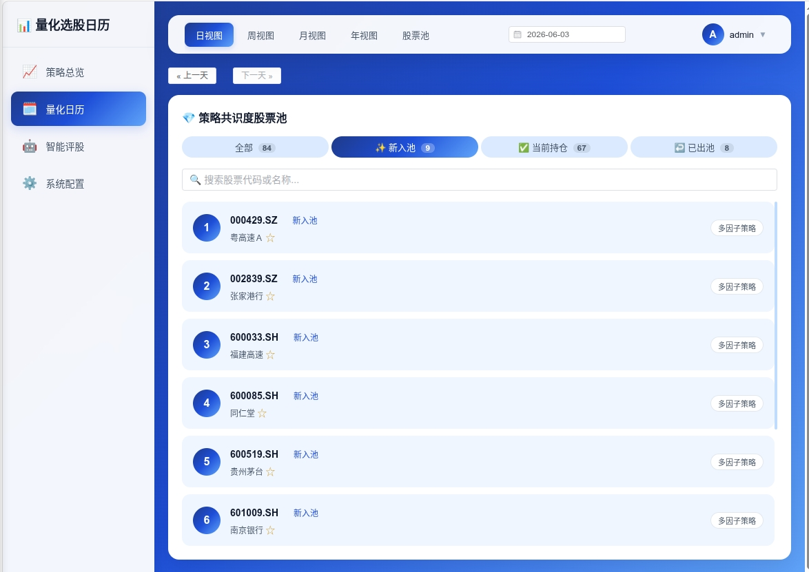
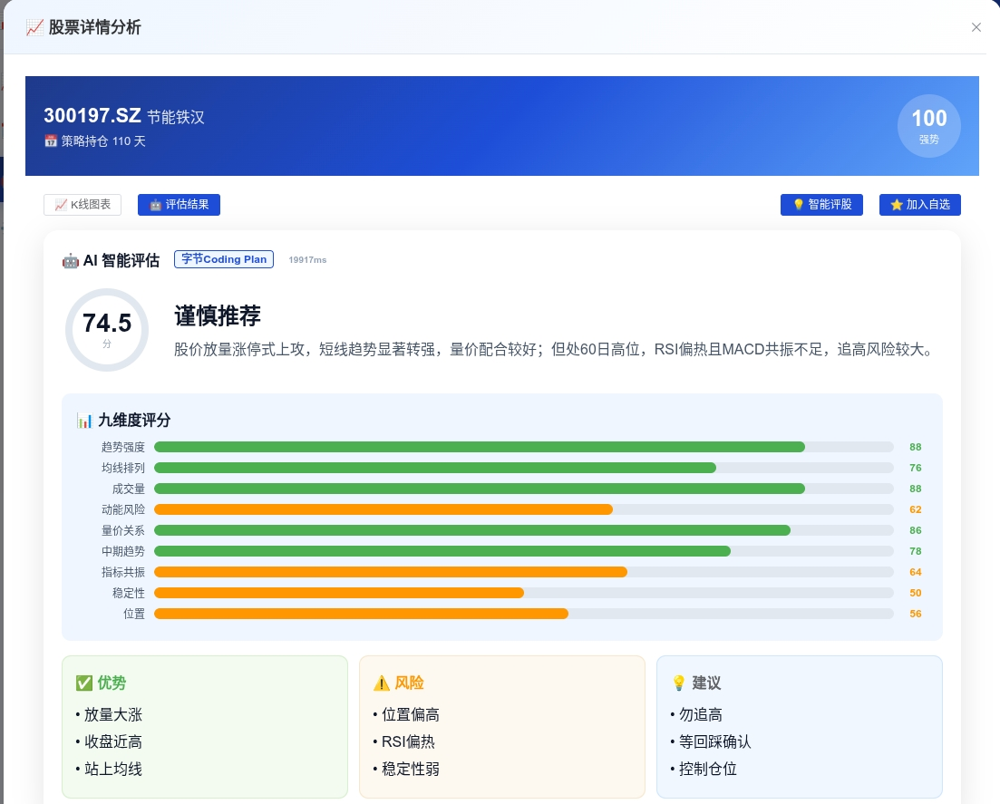
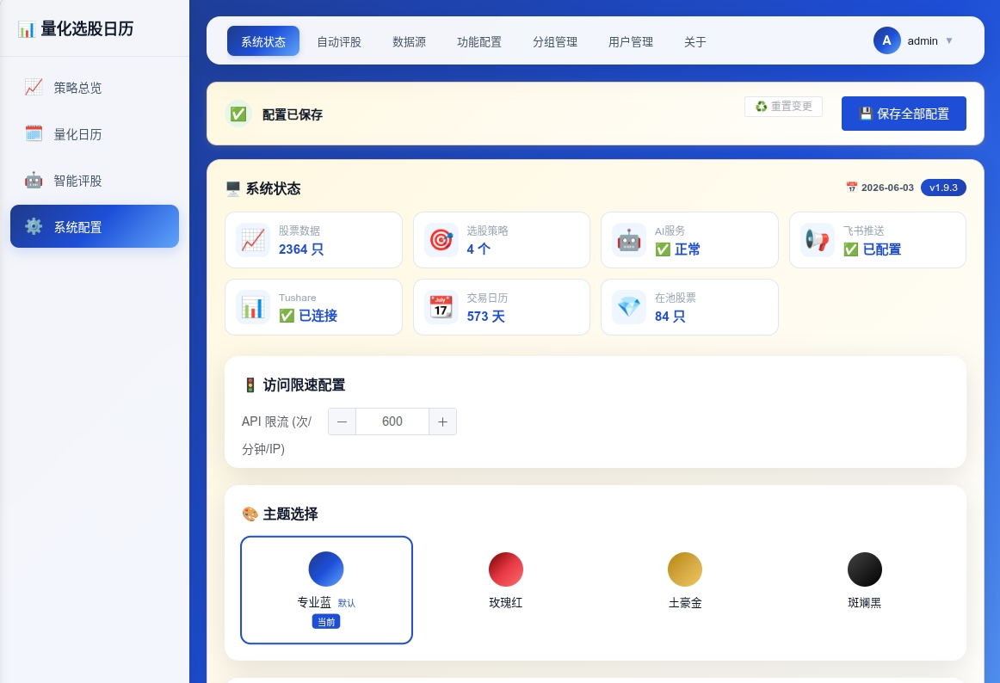

<p align="center">
  <h1 align="center">📅 量化选股日历</h1>
  <p align="center"><strong>Quant Calendar</strong> — 美林时钟 × 多因子策略 × AI 智能评估</p>
  <p align="center">
    
    
    
    
  </p>
</p>

---

## 这是什么？

一个**全功能、开箱即用**的量化投资决策辅助系统。它把**宏观经济周期判断**、**多策略自动选股**和 **AI 智能评估**整合到一个日历界面上，让你像看天气预报一样看 A 股机会。

> 它不是回测框架，不是数据平台——它是你的**每日选股工作台**。

## 核心亮点

| 模块 | 做什么 | 亮点 |
|------|--------|------|
| 🕐 **美林时钟** | 五维度宏观评分，判断经济周期阶段 | 图形化时钟面板，阶段切换自动标记 |
| 📊 **多策略选股** | 动量/反转/成长/价值 多因子策略 | 4 大策略独立运行，共识榜交叉验证 |
| 🤖 **AI 智能评股** | 多模型串行评估个股 | 支持 OpenAI / DeepSeek / 豆包 / 通义千问 等 |
| 📅 **量化日历** | 日/周/月/年视图 + K 线图 | 选股结果按天展示，一眼看穿持仓变化 |
| 📨 **飞书推送** | 定时推送选股结果 | 每日早盘前自动发送，支持 Webhook 机器人 |
| 👥 **多用户系统** | 管理组/用户组/访客组 | 独立自选股和评估历史，权限隔离 |
| 🎨 **主题系统** | 4 套主题 + 深色模式 | 科技蓝 / 玫瑰红 / 活力橙 / 暗夜 |

## 界面预览

**策略总览** — 4 策略共识榜 + 股票池，高共识股票一眼识别，支持按策略/行业/市值多维度筛选

<p align="center">
  
</p>


**量化日历** — 日、周、月、年视图，选股结果按日期展开，内置 MA/成交量/快捷时间范围

<p align="center">
  
</p>


**AI 评估** — 多模型串行评股记录，技术指标自动注入（RSI/MACD/布林带/KDJ），按用户隔离

<p align="center">
  
</p>


**系统配置** — 双数据源热备（sxsc_tushare + tushare + akshare），飞书 Webhook 推送，AI 模型管理

<p align="center">
  
</p>

## 快速开始

```bash
# 1. 安装依赖
cd quant-calendar-ops/backend
pip install -r requirements.txt

# 2. 配置 Tushare Token
cp .env.example .env
# 编辑 .env，填入你的 TUSHARE_TOKEN（去 https://tushare.pro/ 注册）

# 3. 启动
python main_new.py --port 8000

# 4. 打开浏览器
# http://localhost:8000
# 默认账号: admin / admin
```

> ⚠️ 首次登录后**立即修改 admin 密码**。

## 仓库结构

```
quant-calendar/
├── README.md                    ← 你在这里
├── .gitignore
├── quant-calendar-ops/          ← 应用代码
│   ├── backend/                 ← FastAPI 后端
│   │   ├── main_new.py          ← 主入口
│   │   ├── merrill_clock.py     ← 美林时钟
│   │   ├── ai_evaluator.py      ← AI 多模型评股
│   │   ├── data_sources.py      ← 多数据源管理
│   │   ├── scheduler.py         ← 定时任务
│   │   └── api/v1/              ← REST API 路由
│   ├── frontend/                ← Vue 3 SPA（单文件）
│   │   ├── index.html           ← 前端全部逻辑
│   │   └── lib/                 ← JS/CSS 库
│   └── tests/                   ← 测试
└── qresult/                     ← 策略选股数据
    ├── 多因子策略持仓.csv        ← 动量+反转+质量多因子
    ├── 行业轮动策略持仓.csv      ← 行业轮动信号
    ├── 资金流策略持仓文件.csv    ← 北向资金+主力资金
    └── 指数增强策略持仓.csv      ← 沪深300增强
```

## qresult 数据说明

`qresult/` 目录包含 **4 个量化策略的每日选股结果**，每个策略有两份 CSV（全量版 + 剔除 ST 版）：

| 文件 | 策略 | 说明 |
|------|------|------|
| `多因子策略持仓.csv` | 多因子选股 | 综合动量、反转、质量、低波等多因子打分，每日筛选 Top-N |
| `行业轮动策略持仓.csv` | 行业轮动 | 基于行业动量/景气度轮动信号，选出当前强势行业中的龙头股 |
| `资金流策略持仓文件.csv` | 资金流选股 | 跟踪北向资金、主力资金流向，捕捉大资金建仓标的 |
| `指数增强策略持仓.csv` | 指数增强 | 对标沪深 300，通过因子暴露优化跑赢基准 |

**数据格式：** 每行一个交易日，每列一只股票代码。单元格为空表示未入选，非空表示该日该策略选中此股票。

```
日期       | 000001.SZ | 000002.SZ | 600519.SH | ...
2024-01-02 |           |     ✓     |     ✓     | ...
2024-01-03 |     ✓     |     ✓     |           | ...
```

> 💡 `-剔除ST` 后缀的文件已自动过滤 ST/\*ST 股票，推荐直接使用。

## 技术栈

| 层 | 技术 |
|----|------|
| 后端框架 | Python 3 / FastAPI |
| 前端 | Vue 3 SPA / Element Plus / ECharts |
| 认证 | JWT (python-jose + bcrypt) |
| 数据源 | Tushare Pro / sxsc_tushare / akshare |
| AI 接口 | OpenAI 兼容协议（支持 DeepSeek/豆包/通义千问/GPT/Claude 等） |
| 推送 | 飞书 Webhook 机器人 |
| 存储 | JSON 文件（零依赖数据库） |

## 功能矩阵

### 🕐 美林时钟
- 五维度宏观指标评分（GDP 增速、CPI、PMI、社融、利率）
- 四阶段自动识别：**复苏 → 过热 → 滞涨 → 衰退**
- 阶段切换自动记录历史，回溯宏观择时准确率
- 图形化时钟面板 + 当前阶段高亮

### 📊 策略选股
- 4 大独立策略并行运行，每日输出选股结果
- 共识榜：多策略共同看好的股票，≥3 策略共识高亮
- 股票池：按策略/日期/行业/市值多维度筛选
- K 线图：内置 ECharts，MA/成交量/快捷时间范围

### 🤖 AI 评股
- 支持 8+ 模型提供商（OpenAI / DeepSeek / 豆包 / 通义千问 / Claude / GLM / Moonshot 等）
- **多模型串行评估**：同一只股票由多个 AI 依次打分，取综合评分
- 技术指标自动注入（RSI / MACD / MA / 布林带 / KDJ）
- 评估历史可追溯，按用户隔离

### 👥 多用户权限
- **管理组** — 全部功能 + 系统配置 + 用户管理
- **用户组** — 选股 + 评股 + 自选股
- **访客组** — 只读查看（独立数据隔离）
- 用户与分组合并管理，一键切换组、内联成员操作
- 菜单可见性按组配置，前端动态渲染

### 🚀 自动化
- 定时自动评股（可配置时间 + 策略范围）
- 飞书定时推送每日选股报告
- 数据源双路热备（sxsc_tushare → tushare → akshare）

## 默认账号

| 用户名 | 密码 | 角色 |
|--------|------|------|
| admin | admin | 管理员（全部权限） |
| guest | guest | 访客（只读） |

## 路线图

- [ ] Docker 一键部署
- [ ] PostgreSQL 存储后端
- [ ] 回测模块 — 策略历史收益归因
- [ ] 移动端 PWA 适配
- [ ] 更多 AI 模型集成（Gemini / Llama）
- [ ] 实时行情 WebSocket 推送

## 许可

MIT License — 详见 [LICENSE](quant-calendar-ops/LICENSE)

## 贡献

欢迎提 Issue 和 PR。贡献前请阅读 [DEPLOYMENT.md](quant-calendar-ops/DEPLOYMENT.md) 了解项目结构。

---

<p align="center">
  <sub>Made with ❤️ for A-share quantitative investors</sub>
</p>
