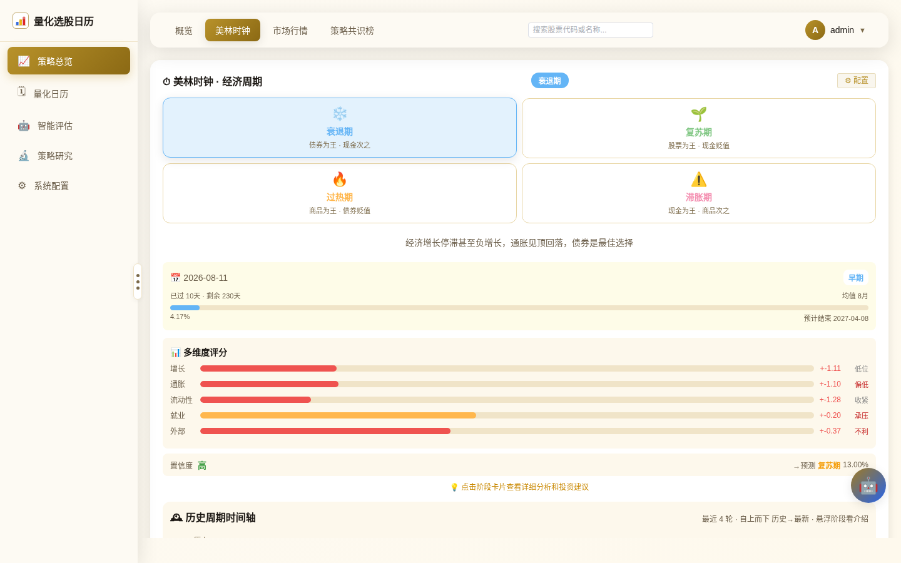
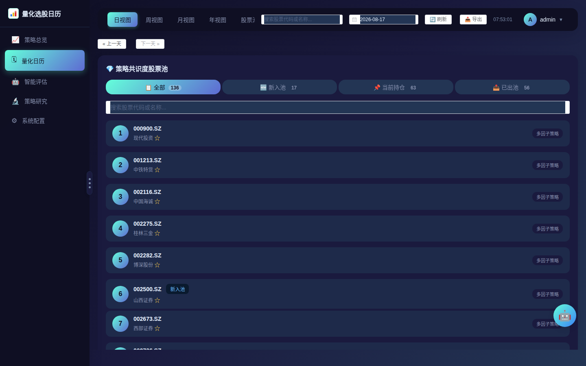
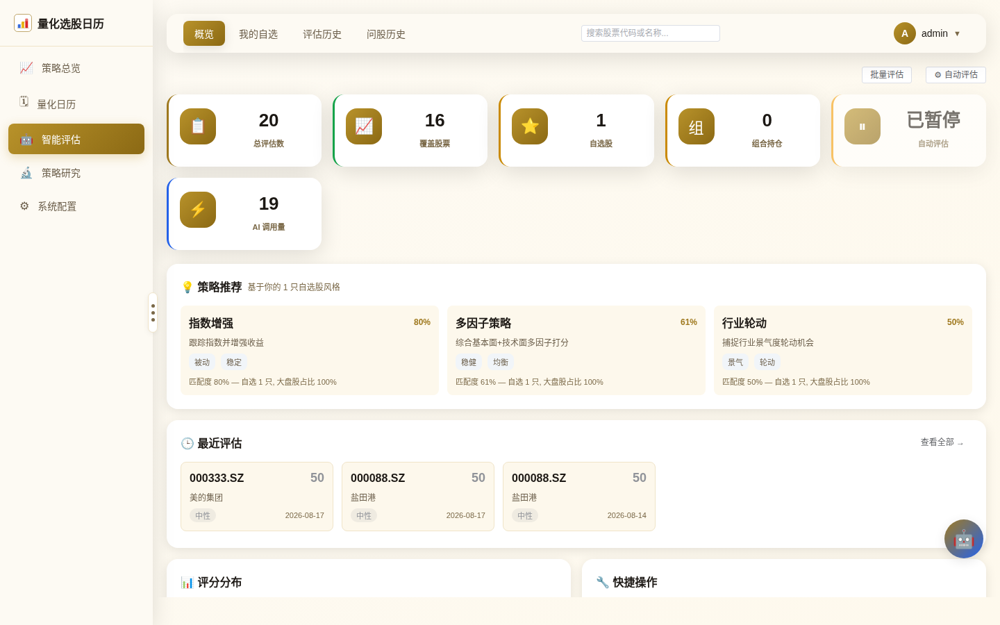
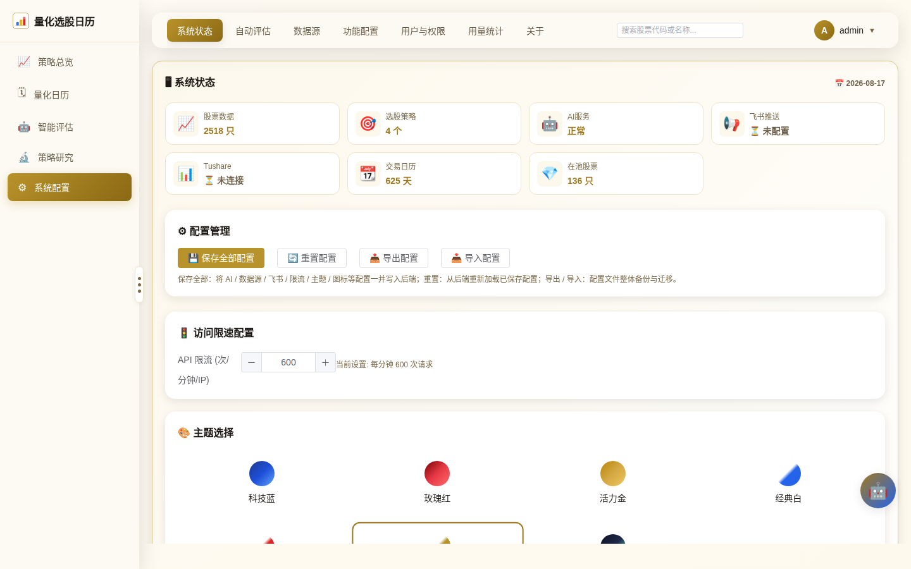

<p align="center">
  
  <h1 align="center">量化选股日历</h1>
  <p align="center">
    <strong>Quant Calendar</strong> — 宏观经济周期、多因子策略选股、AI 智能评估，整合到一个日历界面。
  </p>
  <p align="center">
    <a href="https://github.com/bangbang8000-cell/quant-calendar/releases"></a>
    <a href="LICENSE"></a>
    <a href="#"></a>
    <a href="#"></a>
    <a href="#"></a>
    <a href="#"></a>
    <a href="https://github.com/bangbang8000-cell/quant-calendar/stargazers"></a>
  </p>
</p>

---

## 这是什么

量化选股日历是一个面向 A 股的量化决策辅助工具，开源，本地运行。

它把三个环节串在一起：判断当前宏观经济周期、运行多套策略自动选股、用 AI 逐个评估股票。所有结果集中展示在一个日历界面上。

| 宏观经济周期 | 多策略选股 | AI 评估 |
|:--:|:--:|:--:|
| 美林时钟，五维度评分 | 动量 / 反转 / 质量 / 资金流 | DeepSeek / OpenAI / 豆包 |
| 自动判断复苏-过热-滞涨-衰退 | 4 套策略交叉验证，共识榜汇总 | 技术指标自动注入，多模型串行 |

自 v3.17 起，产品扩展为四大功能域：**智·实主线**（AI 复盘 / 多因子体检 / 回测 / 组合 / 异动）、**架构健康**（组件化 / 可观测性 / 多用户隔离）、**体验卓越**（移动端 / PWA / 性能 / 个性化）、**开放与国际化**（开放 API / Webhook / i18n）。

---

## 界面预览

<details open>
<summary><b>策略总览</b> — 今日一屏、共识榜、股票池、入池/出池统计</summary>
<p align="center">
  
</p>
</details>

<details>
<summary><b>量化日历</b> — 日/周/月/年视图，内置 K 线</summary>
<p align="center">
  
</p>
</details>

<details>
<summary><b>AI 评估</b> — 多模型串行评估，历史追溯</summary>
<p align="center">
  
</p>
</details>

<details>
<summary><b>系统配置</b> — 数据源管理、飞书推送、AI 模型配置</summary>
<p align="center">
  
</p>
</details>

---

## 功能

功能按「模块大类 — 模块小类」两级组织。

### 📊 选股与策略

| 模块小类 | 说明 |
|------|------|
| 策略选股 | 多因子、行业轮动、资金流、指数增强四套策略独立运行，共识榜交叉验证；V4.7 起引擎全市场选股(5550+ 只, 按交易日批量取数) |
| 策略筛选 | 按策略多选过滤日历视图，并集/交集两种匹配模式，实时预览匹配数 |
| 策略数据刷新 | 定时刷新 / 文件变动监听 / 定时拉取日线，支持股票池白名单 |
| 策略研究菜单 | 研究菜单（量化研究/回测/市场复盘/异动扫描）显示开关 |
| 回测工作台 | 单/多策略回测对比，收益/回撤/夏普/净值/年度收益 + CSV 导出 |
| 模拟组合 | 持仓/买卖调仓/实时盈亏/组合收益曲线/审计，按用户隔离 |
| 异动扫描 | 涨停/跌停/放量/振幅/连板分类，自选/持仓事件提醒 |

### 🌐 宏观研判

| 模块小类 | 说明 |
|------|------|
| 美林时钟 | 五维度定量评分 + 四象限可视化，14条历史周期数据覆盖2008年至今4轮完整经济周期 |
| 美林时钟历史 | 非活跃阶段展示全部历史轮次，含触发原因（去杠杆/贸易战/四万亿等）+ GDP/CPI/PMI/PPI关键指标；V4.8 起每阶段独有 essence/亮点/关键指标，点击阶段 chip 弹出锚定右侧的紧凑详情（不遮全图） |
| AI 每日复盘 | 收盘后自动生成市场复盘，指数/板块/资金/情绪 + AI 解读，16:00 调度 |

### 🤖 智能评估

| 模块小类 | 说明 |
|------|------|
| AI 评估 | 多模型串行评估，RSI/MACD/MA/KDJ 自动注入 prompt，支持 8+ 模型 |
| AI 智能问股 | 对话式股票分析，流式输出，融合技术面+基本面+策略面多维度分析；V4.8.2 修复推理模型回复为空(max_tokens 按模型配置) |
| 多因子体检 | 个股五维因子体检（估值/基本面/资金面/情绪面/技术面）+ 分位语义标注 |
| 评估胜率追踪 | 评估命中率统计（总体/分模型/分评级），决策复盘 |

### 🗓️ 日历与行情

| 模块小类 | 说明 |
|------|------|
| 量化日历 | 日/周/月/年视图切换，内置 ECharts K 线图 + MA 均线 + 成交量；V4.7 年视图性能 32 倍提速 |
| 全局搜索 | 股票代码/名称模糊搜索 + 拼音/首字母检索，实时建议 |
| 盘中增强 | WebSocket 实时报价（15s 推送），涨速/量比异动预警，数据源降级占位 |
| 数据导出 | 各视图数据一键导出 CSV |

### ⚙️ 系统与数据管理

| 模块小类 | 说明 |
|------|------|
| 数据源管理 | Tushare Pro / sxsc / akshare 三源热备自动切换，不可达优雅降级 |
| 数据备份恢复 | 一键备份 / 列表恢复 / 导出导入整体迁移 |
| 多用户 | 管理组/用户组/访客组，独立自选股和评估历史，按用户隔离 |
| 可观测性 | Prometheus /metrics + 健康面板（调度/数据源/备份/磁盘）+ 飞书告警 |
| 安全 | JWT + bcrypt + CSP + HSTS + API Key 哈希存储 |

### 🎨 体验与开放平台

| 模块小类 | 说明 |
|------|------|
| UI 主题 | 7 套主题 + 4 套图标系统 + 设计 Token 体系 + 骨架屏加载 |
| 键盘导航 | Tab/Enter 导航，面包屑，侧边栏折叠 |
| 移动端 & PWA | 375px 三任务链路、手势操作、离线核心页可读、版本化缓存 |
| 性能优化 | 首屏 +42%、K 线 5000 点降采样、历史分页懒加载 |
| 个性化 | 偏好持久化（默认视图/主题/周期）、最近查看/收藏直达 |
| 国际化 | 中/英双语切换，偏好持久化重启保持 |
| 初始化向导 | 首次启动引导配置密码、AI Key、Tushare Token |
| 开放 API | API Key 接入只读行情/日历/自选/评估，Swagger 文档，Key 限流 |
| Webhook 订阅 | evaluate_done / review_ready / anomaly_scan_done / market_review_ready 事件推送 |
| 飞书推送 | Webhook 定时推送每日选股报告 |

---

## 仓库结构

本仓库为**扁平结构**（v2.3.0+）：`backend/` 与 `frontend/` 位于仓库根目录，仓库本身即开发目录。生产环境通过 rsync 同步到独立的 `quant-calendar-ops/` 目录运行（各自的 `.env` / `data/` 严格独立）。

```
quant-calendar/
├── README.md
├── DEPLOYMENT.md                ← 部署指南（dev/ops 分离/同步/更新）
├── docs/                        ← 当前文档（PRD/DEV-PLAN/TEST-PLAN v4.1-4.5、UI-ASSESSMENT-V4.6；旧版本归档于 docs/archive/ 本地保留）
├── backend/                     ← FastAPI 后端 (Python)
│   ├── main_new.py              ← 主入口（APP_VERSION 单一来源）
│   ├── merrill_clock.py         ← 美林时钟引擎（五维度评分+周期判断）
│   ├── ai_evaluator.py          ← AI 多模型评估 + 每日复盘生成
│   ├── data_sources.py          ← 多数据源管理 (sxsc/tushare/akshare)
│   ├── factor_engine.py         ← 多因子引擎（估值/基本面/资金面/情绪面/技术面）
│   ├── portfolio.py             ← 模拟组合/持仓（backend 层）
│   ├── market_review.py         ← AI 每日复盘
│   ├── scan_engine.py           ← 异动扫描（涨停/跌停/放量/连板）
│   ├── eval_track.py            ← 评估胜率追踪
│   ├── backtest.py              ← 回测核心
│   ├── api_keys.py              ← 开放 API Key（仅存哈希）
│   ├── webhook.py               ← Webhook 事件订阅
│   ├── metrics.py               ← Prometheus 可观测性 (/metrics)
│   ├── scheduler.py             ← 定时任务调度
│   └── api/v1/                  ← REST API（含 /api/openapi 开放端点）
├── frontend/                    ← Vue 3 SPA（零构建）
│   ├── index.html               ← 单文件应用
│   ├── css/                     ← tokens.css / themes.css / layout.css
│   ├── js/                      ← JS 模块（locales/ 中英语言包、sw.js PWA、components/ 页面组件）
│   └── lib/                     ← Element Plus / ECharts
├── tests/                       ← pytest 全量 1068 项 + e2e 冒烟
└── data/                        ← 本地数据（gitignore：stock_info.json 等；qresult 持仓 CSV 亦本地生成不入库）
```

---

## 技术栈

| 层 | 技术 | 备注 |
|----|------|------|
| 后端 | FastAPI (Python 3.10+) | 异步，自带 OpenAPI 文档 |
| 认证 | JWT (python-jose) + bcrypt | 24h 过期，角色权限，多用户隔离 |
| 数据源 | Tushare Pro / sxsc_tushare / akshare | 三源热备自动切换，不可达优雅降级 |
| AI | OpenAI 兼容协议 | DeepSeek / 豆包 / 通义千问 / GPT / Claude / GLM / Moonshot |
| 推送 | 飞书 Webhook | 机器人消息推送 + Webhook 事件订阅 |
| 存储 | SQLite + JSON | 写路径统一 SQLite，无数据库依赖可部署 |
| 可观测性 | Prometheus /metrics | 请求/状态/延迟/数据源/调度/备份/磁盘 + 飞书告警 |
| 开放 API | FastAPI OpenAPI + API Key | 只读端点，Swagger 开关，Key 限流 |
| 前端 | Vue 3 + Element Plus + ECharts | Vite 构建 SPA（dist 入库, 部署免 Node），中英 i18n，PWA 离线 |

---

## 快速开始

### Docker（推荐）

```bash
docker pull ghcr.io/bangbang8000-cell/quant-calendar:latest

docker run -d --name quant-calendar -p 8000:8000 \
  -v quant-calendar-data:/app/data \
  ghcr.io/bangbang8000-cell/quant-calendar:latest
```

浏览器打开 http://localhost:8000，登录后跟随初始化向导配置 Tushare Token 和 AI Key。

如需使用自己的策略数据：
```bash
docker run -d --name quant-calendar -p 8000:8000 \
  -v quant-calendar-data:/app/data \
  -v /path/to/your/qresult:/data/qresult:ro \
  ghcr.io/bangbang8000-cell/quant-calendar:latest
```

GitHub Actions 在推送版本标签时自动构建并推送镜像到 ghcr.io。

### 源码安装

环境要求：Python 3.10+，[Tushare Pro](https://tushare.pro/) 账号。

```bash
git clone https://github.com/bangbang8000-cell/quant-calendar.git
cd quant-calendar/backend

pip install -r requirements.lock

cp ../.env.example .env
# 编辑 .env，填入 TUSHARE_TOKEN=***

### 密钥查看（系统页 API Key / Token 完整值）

系统页（设置 → 数据源 / AI）中的大模型 API Key 与 tushare/sxsc Token 默认以掩码形式展示（只显示首尾几位，中间为星号）。如需查看完整值，点击输入框右侧的查看图标，输入查看密码即可。

| 项 | 说明 |
|----|------|
| 查看密码 | 默认 admin123；**V4.1+ 需在 .env 显式配置 KEY_VIEW_PASSWORD 才能查看**（未配置时默认口令拒绝），可用 `KEY_VIEW_PASSWORD=admin123` 或自定义强口令 |
| 掩码规则 | 长度大于8：首4尾4；长度4-8：首2尾2；长度不超过4：首1位加星号 |
| 权限 | 仅管理员（admin 角色）可执行查看操作 |
python main_new.py --port 8000
```

无需 MySQL、Redis、GPU。

### 默认账号

| 用户名 | 密码 | 角色 | 权限 |
|--------|------|------|------|
| `admin` | `admin` | 管理员 | 全部功能 + 系统配置 + 用户管理 |
| `guest` | `guest` | 访客 | 只读查看 |

首次登录后请修改 admin 密码。

---

## 注意事项

### 1. Tushare 数据源 Token 必须配置真实值

Tushare Pro 数据源需要真实 Token 才能正常拉取行情。请在 **系统配置 → 数据源** 中填入有效 Token 后点击「测试」。

- 若提示 **"数据源 tushare 未初始化"**：多为 Token 未配置或配置为空，请到数据源页填写。
- 若提示 **"您的token不对"**：Token 无效或过期，请核对 Tushare Pro 后台的 Token。
- 三源热备（sxsc-tushare → tushare → akshare），tushare 失败会自动降级 akshare（部分数据可能延迟）。

### 2. 密钥查看密码（V4.1+ 需显式配置）

系统页的 API Key / Token 以掩码展示，查看完整值需输入查看密码（系统页 → 数据源/AI → 眼睛图标）。

- **V4.1 起安全策略**：未在 `.env` 显式配置 `KEY_VIEW_PASSWORD` 时，默认口令 `admin123` 会被**拒绝查看**（防默认口令泄露密钥）。
- **如需用默认口令查看**：在 `.env` 加入 `KEY_VIEW_PASSWORD=admin123` 后重启。
- **更安全做法**：配置自定义强口令 `KEY_VIEW_PASSWORD=你的强口令`。

### 3. 其他

- 默认登录账号 `admin/admin`（源码安装）或初始化向导设置；首次登录请修改密码。
- 前端为 Vite 构建产物（`frontend/dist/` 已入库），直接部署无需 Node；修改前端源码需 `npm run build` 后重启。

---

## 版本历史

| 版本 | 日期 | 变更 |
|------|------|------|
| v4.8.2 | 2026-08 | 暗色质感补全：dark-pro 阴影层级令牌(--shadow-sm/md/lg 0.35/0.45/0.55) / ECharts 网格线与轴线专用令牌联动(暗色可见) / 时间轴点击弹窗锚定被点击阶段 chip 右侧(绝对定位) / 个股问股修复(推理模型 max_tokens 不再 2048 硬截断, v4-flash 完整回复) / 1068 测试全绿 |
| v4.8.1 | 2026-08 | 暗色审计：dark-pro 使用处硬编码清零(令牌化) / WCAG AA 对比度补强(text-disabled 3.5:1, border-heavy 3.06:1) / 时间轴 dark 适配(连接线/当前徽标/chip) / 搜索股票无法弹详情修复(UMD CJS 挂载跳过, 内联 dispatch fallback) / 1062 测试全绿 |
| v4.8.0 | 2026-08 | 时间轴个性化：每阶段独有信息(STAGE_BRIEFS essence/触发/关键指标/亮点) + 点击内嵌紧凑弹窗 + hover 亮点 / 默认主题活力金(vibrant-orange, 仅未设置时生效) / 1056 测试全绿 |
| v4.7.1 | 2026-08 | 持仓矩阵生成并发安全：引擎 run-once 异步化(to_thread 不阻塞事件循环) / 持仓文件原子写入(tmp+os.replace) / save_state 部分更新保留 universe / 1028 测试全绿 |
| v4.7.0 | 2026-08 | 数据真实化：引擎全市场批量取数(universe=all, 持仓 8 列→5557 列) / 日视图选股池真实轮动 / 年视图性能 32 倍提速(8.7s→0.27s) / 全市场按交易日批量接口 |
| v4.6.0 | 2026-08 | 美术打磨：间距 4px 网格系统化 / 动效统一 / 排版令牌化 / 圆角阴影收敛 / 配色主题优化(主色对比度门禁) / 导航图标系统回归(emoji-edge-crystal 可切换) / 1011 测试全绿 |
| v4.5.0 | 2026-08 | 便捷收尾：美林时钟全局快捷入口 + 配置就近 / 登录并行加载 / 按钮反馈 / ai_models.py 拆分 / CI 版本 gate / 流程脚本化 |
| v4.4.0 | 2026-08 | 体验筑基：令牌体系补全门禁 / dark 令牌层 / WCAG 对比度 / 主题收敛 / 可访问性(WCAG 1.4.4) |
| v4.3.0 | 2026-08 | 首屏分包：Vite 构建层 / 页面懒加载(首屏 577→367KB) / dist 入库 |
| v4.2.0 | 2026-08 | 逻辑通畅：ops 域注入复活 / WS 依赖 / 竞态保护 / 侧栏持久化 |
| v4.1.0 | 2026-08 | 安全加固：敏感端点 deny-by-default / SSRF / JWT 会话 / 口令策略 / 限流实化 |
| v3.17.3 | 2026-08 | 定版 + 系统配置页 UI 优化 + 功能配置按「模块大类-模块小类」两级重组 + SVG 图标修复 + 美林时钟弹窗闪动修复 + 侧边栏手柄优化 + i18n 国际化 + 开放 API v2 + 719 测试全绿 |
| v3.17.2 | 2026-08 | 移动端一等公民 + PWA 离线 + 首屏 +42% + 个性化/拼音搜索 + WS 盘中实时报价 |
| v3.17.1 | 2026-08 | app-logic 域拆分 + 内联样式治理 698→1 + 多用户隔离 + Prometheus 可观测性 |
| v3.17.0 | 2026-08 | 回测工作台 + 胜率追踪 + 模拟组合 + 异动扫描 |
| v3.16 | 2026-08 | 智能评估修复（自选K线/评估历史/问股历史）+ 股票详情弹窗性能优化 + 质量护栏 |
| v3.15.1 | 2026-08 | 视觉回归基线、UI 审计修复 |
| v3.14.0 | 2026-08 | 前端组件化拆分、备份恢复、页面热度 |
| v3.10.0 | 2026-08 | 前端模块化、主题 Token、性能优化 |
| v3.1.0 | 2026-07 | 美林时钟历史周期数据：14条结构化转换记录（2008-至今），弹窗展示触发原因+关键指标 |
| v3.0.0 | 2026-07 | 美林时钟模块解耦：提取 merrill.js composable，清理 ~1400 行冗余代码，CSS Token 体系 |
| v2.5.0 | 2026-07 | UI 全面升级：侧边栏修复、Token 去重、8 Composables 清理、移动端增强 |
| v2.4.0 | 2026-06 | AI 智能问股：对话式股票分析，流式输出 |
| v2.3.0 | 2026-06 | UI Redesign：7 套主题、4 套图标系统、响应式布局、动画系统 |

## 路线图

- ✅ 策略回测收益归因可视化（v3.17 已交付回测工作台）
- ✅ 移动端 PWA 离线支持（v3.17 已交付）
- ✅ 实时行情 WebSocket 推送（v3.17 已交付盘中增强，部署环境装齐 websockets 依赖后真实推送）
- 开放 API 扩容（更多端点/写权限/按用户配额）
- 更多语言包（en 之外）
- PostgreSQL 存储后端（可选替代 SQLite）
- 真实行情数据源接入后的完整链路验证

---

## 免责声明

本工具仅用于数据分析和研究参考，不构成任何投资建议。所有选股结果和 AI 评估结论均为基于历史数据的统计分析，不代表对未来收益的预测或保证。股市有风险，投资需谨慎。使用者应独立判断并自行承担投资风险。

---

## 贡献

欢迎提 Issue、PR。

贡献前可阅读 [DEPLOYMENT.md](DEPLOYMENT.md) 了解项目结构。新功能建议先开 Issue 讨论。PR 请确保不包含硬编码密钥。

---

## 许可

MIT License — 详见 [LICENSE](LICENSE)

---

## Star History

<a href="https://star-history.com/#bangbang8000-cell/quant-calendar&Date">
  <picture>
    <source media="(prefers-color-scheme: dark)" srcset="https://api.star-history.com/svg?repos=bangbang8000-cell/quant-calendar&type=Date&theme=dark" />
    <source media="(prefers-color-scheme: light)" srcset="https://api.star-history.com/svg?repos=bangbang8000-cell/quant-calendar&type=Date" />
    
  </picture>
</a>

---

<p align="center">
  <sub>Made with love for A-share quantitative investors</sub>
</p>
