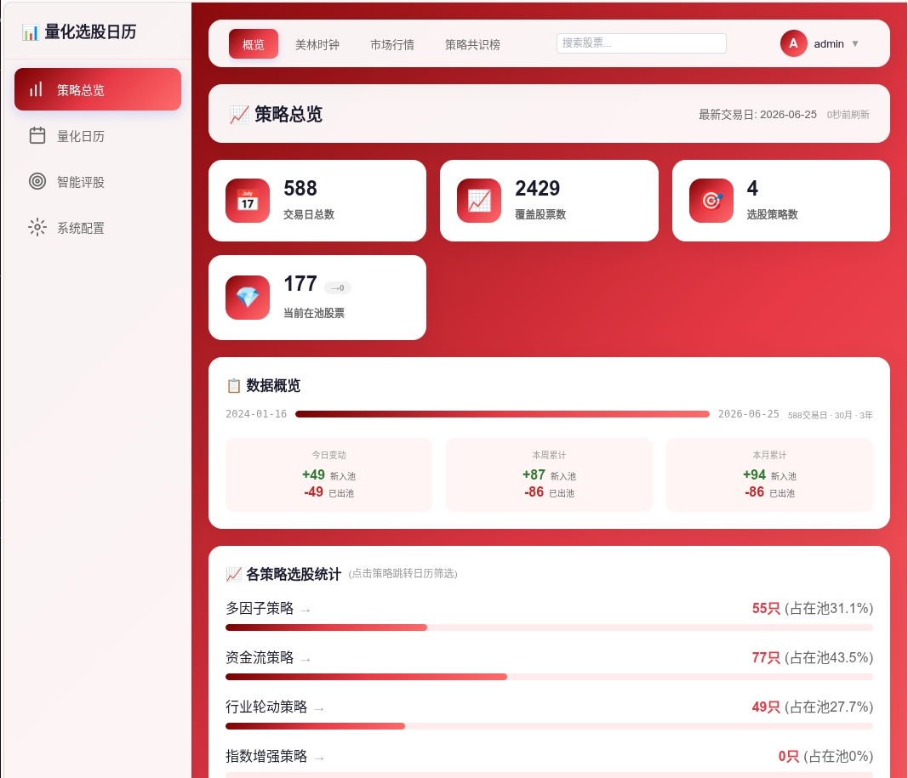
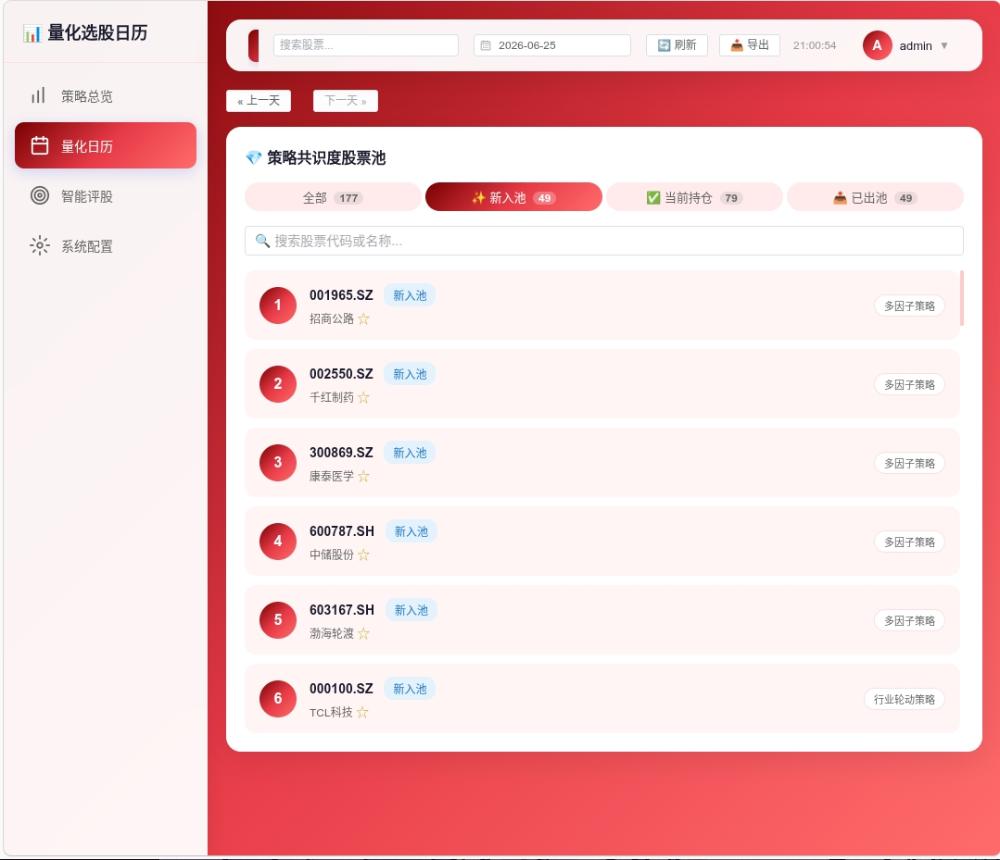
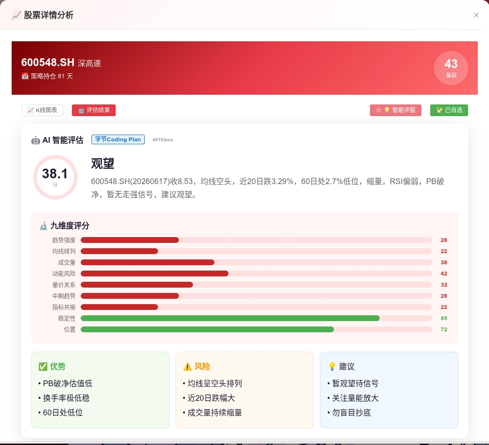
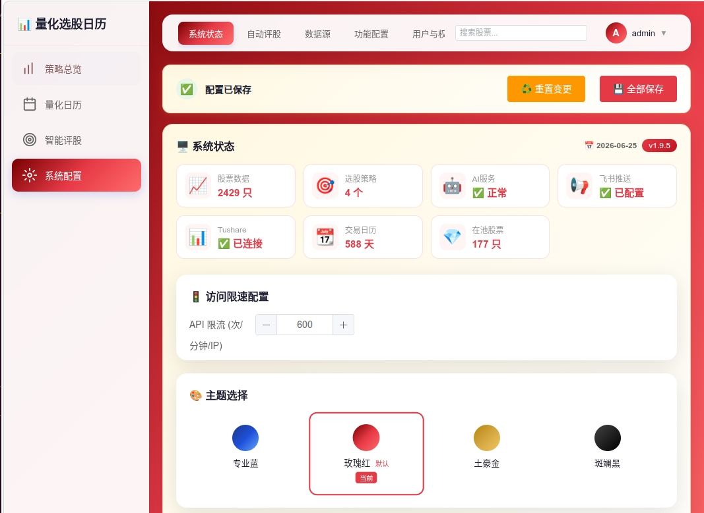

<p align="center">
  <h1 align="center">量化选股日历</h1>
  <p align="center">
    <strong>Quant Calendar</strong> — 宏观经济周期、多因子策略选股、AI 智能评估，整合到一个日历界面。
  </p>
  <p align="center">
    <a href="https://github.com/bangbang8000-cell/quant-calendar/releases"></a>
    <a href="LICENSE"></a>
    <a href="#"></a>
    <a href="#"></a>
    <a href="#"></a>
    <a href="#"></a>
    <a href="https://github.com/bangbang8000-cell/quant-calendar/stargazers"></a>
  </p>
</p>

---

## 这是什么

量化选股日历是一个面向 A 股的量化决策辅助工具，开源，本地运行。

它把三个环节串在一起：判断当前宏观经济周期、运行多套策略自动选股、用 AI 逐个评估股票。所有结果集中展示在一个日历界面上。

| 宏观经济周期 | 多策略选股 | AI 评估 |
|:--:|:--:|:--:|
| 美林时钟，五维度评分 | 动量 / 反转 / 质量 / 资金流 | DeepSeek / OpenAI / 豆包 |
| 自动判断复苏-过热-滞涨-衰退 | 4 套策略交叉验证，共识榜汇总 | 技术指标自动注入，多模型串行 |

---

## 界面预览

<details open>
<summary><b>策略总览</b> — 共识榜、股票池、入池/出池统计</summary>
<p align="center">
  
</p>
</details>

<details>
<summary><b>量化日历</b> — 日/周/月/年视图，内置 K 线</summary>
<p align="center">
  
</p>
</details>

<details>
<summary><b>AI 评估</b> — 多模型串行评估，历史追溯</summary>
<p align="center">
  
</p>
</details>

<details>
<summary><b>系统配置</b> — 数据源管理、飞书推送、AI 模型配置</summary>
<p align="center">
  
</p>
</details>

---

## 功能

| 模块 | 说明 |
|------|------|
| 美林时钟 | 五维度定量评分 + 四象限可视化，14条历史周期数据覆盖2008年至今4轮完整经济周期 |
| 美林时钟历史 | 非活跃阶段展示全部历史轮次，含触发原因（去杠杆/贸易战/四万亿等）+ GDP/CPI/PMI/PPI关键指标 |
| 策略选股 | 多因子、行业轮动、资金流、指数增强四套策略独立运行，共识榜交叉验证 |
| AI 评估 | 多模型串行评估，RSI/MACD/MA/KDJ 自动注入 prompt，支持 8+ 模型 |
| AI 智能问股 | 对话式股票分析，流式输出，融合技术面+基本面+策略面多维度分析 |
| 量化日历 | 日/周/月/年视图切换，内置 ECharts K 线图 + MA 均线 + 成交量 |
| 全局搜索 | 股票代码/名称模糊搜索，实时建议 |
| 数据导出 | 各视图数据一键导出 CSV |
| 飞书推送 | Webhook 定时推送每日选股报告 |
| 多用户 | 管理组/用户组/访客组，独立自选股和评估历史 |
| UI 主题 | 7 套主题 + 4 套图标系统 + 设计 Token 体系 + 骨架屏加载 |
| 键盘导航 | Tab/Enter 导航，面包屑，侧边栏折叠 |
| 初始化向导 | 首次启动引导配置密码、AI Key、Tushare Token |
| AI 每日复盘 | 收盘后自动生成市场复盘，指数/板块/资金/情绪 + AI 解读，16:00 调度 |
| 多因子体检 | 个股五维因子体检（估值/基本面/资金面/情绪面/技术面）+ 分位语义标注 |
| 回测工作台 | 单/多策略回测对比，收益/回撤/夏普/净值/年度收益 + CSV 导出 |
| 评估胜率追踪 | 评估命中率统计（总体/分模型/分评级），决策复盘 |
| 模拟组合 | 持仓/买卖调仓/实时盈亏/组合收益曲线 |
| 异动扫描 | 涨停/跌停/放量/振幅/连板分类，自选/持仓事件提醒 |
| 移动端 & PWA | 375px 三任务链路、手势操作、离线核心页可读、版本化缓存 |
| 开放 API | API Key 接入只读行情/日历/自选/评估，Swagger 文档，Key 限流 |
| Webhook 订阅 | evaluate_done / review_ready / anomaly_scan_done / market_review_ready 事件推送 |
| 国际化 | 中/英双语切换，偏好持久化重启保持 |
| 可观测性 | Prometheus /metrics + 健康面板（调度/数据源/备份/磁盘）+ 飞书告警 |
| 安全 | JWT + bcrypt + CSP + HSTS + API Key 哈希存储 |

---

## 仓库结构

本仓库采用**双目录物理分离**：`quant-calendar-dev/`（开发，端口 8001）与 `quant-calendar-ops/`（生产，端口 8000）同源同步；各自的 `.env` / `data/` / `.venv` 严格独立。

```
quant-calendar/
├── README.md
├── DEPLOYMENT.md                ← 部署指南（双端分离/同步/更新）
├── docs/                        ← 需求与计划（PRD-v3.17、DEV-TEST-PLAN-v3.17 等）
├── quant-calendar-dev/          ← 开发环境（端口 8001）
│   ├── backend/                 ← FastAPI 后端 (Python)
│   │   ├── main_new.py          ← 主入口（APP_VERSION 单一来源）
│   │   ├── merrill_clock.py     ← 美林时钟引擎（五维度评分+周期判断）
│   │   ├── ai_evaluator.py      ← AI 多模型评估 + 每日复盘生成
│   │   ├── data_sources.py      ← 多数据源管理 (sxsc/tushare/akshare)
│   │   ├── factor_engine.py     ← 多因子引擎（估值/基本面/资金面/情绪面/技术面）
│   │   ├── portfolio.py         ← 模拟组合/持仓（backend 层）
│   │   ├── market_review.py     ← AI 每日复盘
│   │   ├── scan_engine.py       ← 异动扫描（涨停/跌停/放量/连板）
│   │   ├── eval_track.py        ← 评估胜率追踪
│   │   ├── backtest.py          ← 回测核心
│   │   ├── api_keys.py          ← 开放 API Key（仅存哈希）
│   │   ├── webhook.py           ← Webhook 事件订阅
│   │   ├── metrics.py           ← Prometheus 可观测性 (/metrics)
│   │   ├── scheduler.py         ← 定时任务调度
│   │   └── api/v1/              ← REST API（含 /api/openapi 开放端点）
│   ├── frontend/                ← Vue 3 SPA（零构建）
│   │   ├── index.html           ← 单文件应用
│   │   ├── css/                 ← tokens.css / themes.css / layout.css
│   │   ├── js/                  ← JS 模块（含 locales/ 中英语言包、sw.js PWA）
│   │   └── lib/                 ← Element Plus / ECharts
│   └── tests/                   ← pytest 全量 719 项 + e2e 冒烟
└── quant-calendar-ops/          ← 生产环境（端口 8000，同源同步）
```

---

## 技术栈

| 层 | 技术 | 备注 |
|----|------|------|
| 后端 | FastAPI (Python 3.10+) | 异步，自带 OpenAPI 文档 |
| 认证 | JWT (python-jose) + bcrypt | 24h 过期，角色权限，多用户隔离 |
| 数据源 | Tushare Pro / sxsc_tushare / akshare | 三源热备自动切换，不可达优雅降级 |
| AI | OpenAI 兼容协议 | DeepSeek / 豆包 / 通义千问 / GPT / Claude / GLM / Moonshot |
| 推送 | 飞书 Webhook | 机器人消息推送 + Webhook 事件订阅 |
| 存储 | SQLite + JSON | 写路径统一 SQLite，无数据库依赖可部署 |
| 可观测性 | Prometheus /metrics | 请求/状态/延迟/数据源/调度/备份/磁盘 + 飞书告警 |
| 开放 API | FastAPI OpenAPI + API Key | 只读端点，Swagger 开关，Key 限流 |
| 前端 | Vue 3 + Element Plus + ECharts | 单文件 SPA，无需编译，中英 i18n，PWA 离线 |

---

## 快速开始

### Docker（推荐）

```bash
docker pull ghcr.io/bangbang8000-cell/quant-calendar:latest

docker run -d --name quant-calendar -p 8000:8000 \
  -v quant-calendar-data:/app/data \
  ghcr.io/bangbang8000-cell/quant-calendar:latest
```

浏览器打开 http://localhost:8000，登录后跟随初始化向导配置 Tushare Token 和 AI Key。

如需使用自己的策略数据：
```bash
docker run -d --name quant-calendar -p 8000:8000 \
  -v quant-calendar-data:/app/data \
  -v /path/to/your/qresult:/data/qresult:ro \
  ghcr.io/bangbang8000-cell/quant-calendar:latest
```

GitHub Actions 在推送版本标签时自动构建并推送镜像到 ghcr.io。

### 源码安装

环境要求：Python 3.10+，[Tushare Pro](https://tushare.pro/) 账号。

```bash
git clone https://github.com/bangbang8000-cell/quant-calendar.git
cd quant-calendar/quant-calendar-ops/backend

pip install -r requirements.lock

cp .env.example .env
# 编辑 .env，填入 TUSHARE_TOKEN=***
python main_new.py --port 8000
```

无需 MySQL、Redis、GPU。

### 默认账号

| 用户名 | 密码 | 角色 | 权限 |
|--------|------|------|------|
| `admin` | `admin` | 管理员 | 全部功能 + 系统配置 + 用户管理 |
| `guest` | `guest` | 访客 | 只读查看 |

首次登录后请修改 admin 密码。

---

## 版本历史

| 版本 | 日期 | 变更 |
|------|------|------|
| v3.17 | 2026-08 | 智·实主线（AI 复盘/多因子体检/回测/胜率追踪/组合/异动）+ 架构健康（拆分/内联治理/鉴权收敛/可观测性/多用户隔离）+ 体验卓越（移动端/PWA/性能+42%/个性化/盘中增强）+ 开放与国际化（开放 API/Webhook/i18n）；719 测试全绿 |
| v3.15.1 | 2026-08 | 视觉回归基线、UI 审计修复 |
| v3.14.0 | 2026-08 | 前端组件化拆分、备份恢复、页面热度 |
| v3.10.0 | 2026-08 | 前端模块化、主题 Token、性能优化 |
| v3.1.0 | 2026-07 | 美林时钟历史周期数据：14条结构化转换记录（2008-至今），弹窗展示触发原因+关键指标 |
| v3.0.0 | 2026-07 | 美林时钟模块解耦：提取 merrill.js composable，清理 ~1400 行冗余代码，CSS Token 体系 |
| v2.5.0 | 2026-07 | UI 全面升级：侧边栏修复、Token 去重、8 Composables 清理、移动端增强 |
| v2.4.0 | 2026-06 | AI 智能问股：对话式股票分析，流式输出 |
| v2.3.0 | 2026-06 | UI Redesign：7 套主题、4 套图标系统、响应式布局、动画系统 |

## 路线图

- ✅ 策略回测收益归因可视化（v3.17 已交付回测工作台）
- ✅ 移动端 PWA 离线支持（v3.17 已交付）
- ✅ 实时行情 WebSocket 推送（v3.17 已交付盘中增强，部署环境装齐 websockets 依赖后真实推送）
- 开放 API 扩容（更多端点/写权限/按用户配额）
- 更多语言包（en 之外）
- PostgreSQL 存储后端（可选替代 SQLite）
- 真实行情数据源接入后的完整链路验证

---

## 免责声明

本工具仅用于数据分析和研究参考，不构成任何投资建议。所有选股结果和 AI 评估结论均为基于历史数据的统计分析，不代表对未来收益的预测或保证。股市有风险，投资需谨慎。使用者应独立判断并自行承担投资风险。

---

## 贡献

欢迎提 Issue、PR。

贡献前可阅读 [DEPLOYMENT.md](quant-calendar-ops/DEPLOYMENT.md) 了解项目结构。新功能建议先开 Issue 讨论。PR 请确保不包含硬编码密钥。

---

## 许可

MIT License — 详见 [LICENSE](quant-calendar-ops/LICENSE)

---

## Star History

<a href="https://star-history.com/#bangbang8000-cell/quant-calendar&Date">
  <picture>
    <source media="(prefers-color-scheme: dark)" srcset="https://api.star-history.com/svg?repos=bangbang8000-cell/quant-calendar&type=Date&theme=dark" />
    <source media="(prefers-color-scheme: light)" srcset="https://api.star-history.com/svg?repos=bangbang8000-cell/quant-calendar&type=Date" />
    
  </picture>
</a>

---

<p align="center">
  <sub>Made with love for A-share quantitative investors</sub>
</p>
