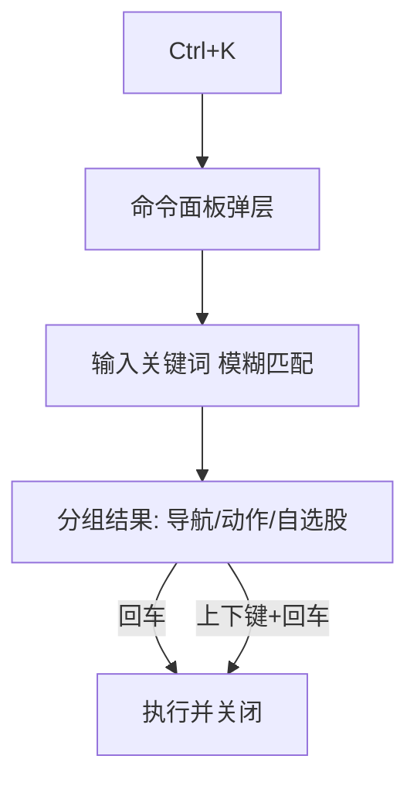

# PRD-6.1.X: 存量功能优化打磨 — 版本演进评估与产品需求

> 版本: v6.1.0 规划基线（覆盖 6.1.0 → 6.1.7 系列迭代）
> 状态: **已批准 → 决策锁定**（2026-09-21 向导问卷 5 项确认，全部按推荐方案）
> 创建: 2026-09-21
> 前置基线: 当前 master `a0b995a5`（V6.11.4，APP_VERSION 5.12.2；V6.10 配色专项 + V6.11 需求轮 2 四批已交付）
> 配套: `docs/DEV&TEST-PLAN-6.1.X.md`（开发与测试计划，独立文档）
> 编写规则: 本 PRD 只描述「做什么」，不描述「怎么做」；未决事项以 `[Assumption]` 标注，待评审确认

---

## 1. 版本演进评估与规划总览

### 1.1 演进背景

产品自 v3.17 起经历了四轮功能扩张：完全体平台（v4.0）、稳定性基座（v5.0）、策略研究与短线复盘主线（v5.1/v5.2）、UI 体验硬化（v5.6-v5.12 及 V6.10/V6.11）。到当前基线为止，**新功能迭代告一段落**：三大功能域（智·实主线 / 架构健康 / 体验卓越）的骨架均已成型，配色专项（V6.10）与需求轮 2（V6.11）完成了最近一轮视觉与偏好链路收敛。

进入存量阶段后，产品的增长逻辑从「加功能」转向「磨体验」。用户明确提出本轮版本目标六项：**易用性、实用性、界面美观度、操作便捷性、运行效率、智能化水平**，并要求从系统架构、软件设计、程序实现、测试体系、UI/UX 设计、用户体验、运维保障七个维度开展演进评估与整体规划。

### 1.2 七维度现状评估

下表汇总当前基线（master `a0b995a5`）的现状判断。证据来源标注为：`[EVAL-*]`（引用 docs/ 下已存档评估报告的实测结论）、`[代码]`（本规划撰写时的代码检查）、`[Assumption]`（推断，待确认）。

| 维度 | 现状判断 | 关键证据 | 6.1.X 方向 |
|---|---|---|---|
| 系统架构 | 中上。FastAPI 模块化路由 + Vue3 SPA，`api/v1/` 分层清晰；双环境（dev/ops）+ 群辉 + GitHub 部署链成型 | `[代码]` `main_new.py` 仅 160 行职责内启动编排；`api/v1/router.py` 收敛路由 | 后端模块边界审计与 `main_new.py` 持续瘦身；前端全局 state 单例拆分（见 G5） |
| 软件设计 | 中上。三层 token 体系 + 运行期求解器为行业水准；V6.10 已把语义色收敛为唯一槽位 `--state-{k}-{text,tint,solid,on-solid}` | `[EVAL-UI-COLOR-SYSTEM]` 语义三套并行定义（已修复）；双源规则（已修复，R2-14） | 深色独立设计（见 C1）；设计令牌与 DESIGN-SYSTEM.md 契约化（见 G2） |
| 程序实现 | 中。死代码清理已有进展（V6.11.2 删除旧时间轴 12.6KB）；`!important` 已收敛；但历史遗留仍存 | `[EVAL-UI-COLOR-SYSTEM]` 死 token 4（白名单）、`[EVAL-UI-GLOBAL]` 228 个 `!important`/295 处硬编码色（基线，部分已清） | 死代码与硬编码色清零门禁；常驻定时器与事件监听审计（见 E4/G2） |
| 测试体系 | 优秀。全量 3361 passed / 0 failed；对比度门禁 14 套 × 36 项契约、偏好链路 e2e、美林阶段带门禁均为运行期真实口径 | `[EVAL-UI-ROUND2 §6.2]` 四批交付每批全量 3361 passed / 0 failed + DOM 审计 0 处 | 视觉回归基线化、性能门禁、新增功能类 e2e（见 G3） |
| UI/UX 设计 | 中上。token 基建与文本对比度达标（6,241 文本节点仅 0-6 处/配置低于 AA）；深色模式从「浅色补丁」走向独立设计 | `[EVAL-UI-COLOR-SYSTEM]` 综合 6.3；`[EVAL-UI-GLOBAL]` 综合 6.0（品牌色面积问题已在 V5.11.0 修复） | 深色独立 + 图表体系收尾（见 C1/C2） |
| 用户体验 | 中。命令面板（12 条）、空错态统一、移动端三任务链路、双栏详情工作区均已落地；术语解释、操作撤销、会话恢复缺失 | `[代码]` 命令面板 DEFAULT_COMMANDS 12 条；`[Assumption]` 术语体系与 undo 无对应实现 | A 组五项（易用性）直接补位 |
| 运维保障 | 中上。健康面板 + 告警分级 + 备份恢复 + 升级回滚演练已有；**版本编号治理是突出短板** | `[代码]` APP_VERSION=5.12.2 而 git 提交线为 V6.11.4、README 标注 v5.12.2、HANDOVER 标注 v5.20，三处不一致 | G1 版本治理统一；G4 运维增强 |

### 1.3 版本编号治理说明

当前存在三套编号并存：提交信息使用 `V6.11.x`，`APP_VERSION` 为 `5.12.2`，README/HANDOVER 又分别记录 `v5.12.2` 与 `v5.20`。历史上有一次「6.N → 5.(N+5)」平移并入，但平移后 V6.10/V6.11 提交线再次出现，编号已无法互推。

**6.1.X 规划决定**：自本规划起，产品进入统一的 **6.1.X** 演进线，编号单一来源为 `APP_VERSION`，提交信息、tag、README 版本历史、HANDOVER 里程碑表全部对齐 `6.1.X`。该决策是 6.1.0 的核心交付（见需求 G1），后续每个 6.1.N 版本可独立发布。

### 1.4 6.1.X 版本目标

| 目标 | 一句话定义 | 对应需求组 | 成功判据（可测） |
|---|---|---|---|
| 易用性 | 新用户能在 10 分钟内独立完成「看一屏 → 查一只 → 评一只」 | A1-A5 | 术语解释覆盖全部指标卡；新手引导完成率 ≥ 80% |
| 实用性 | 数据能带走、能批量处理、能按需提醒 | B1-B5 | 全站导出统一 Excel 多 sheet；预警规则可组合；数据新鲜度可视化 |
| 界面美观度 | 明暗两套都是独立设计，图表与整体语言一致 | C1-C5 | 暗色非文本对比度 ≥ 3:1；全站图表主题统一；动效尊重系统减动效 |
| 操作便捷性 | 高频操作 ≤ 2 步可达，键盘可完成常用流程 | D1-D5 | 命令面板命令 ≥ 40 条；全局搜索跨 6 类实体；右键菜单覆盖 4 个高频列表 |
| 运行效率 | 首屏、列表、接口三类场景均达到预算内 | E1-E5 | LCP ≤ 2.5s；万行列表滚动无卡顿；热点 API P95 ≤ 300ms |
| 智能化水平 | AI 结论可解释、可追踪、可自动择优 | F1-F5 | 评估输出 JSON 结构化；胜率追踪支持模型推荐；晨晚报每日自动生成 |

## 2. 行业最佳实践参考

以下实践来自通用领域共识（量化终端、效率工具、设计系统与 Web 性能规范），用于校准 6.1.X 的需求优先级，不做外部数据引用。

| 领域 | 最佳实践 | 对 6.1.X 的启示 |
|---|---|---|
| 量化终端（Wind / iFinD / Choice 类） | 术语即解释（指标 hover 说明）、专业数据密度、快捷键直达、看板化呈现 | A1 术语体系、D1 命令面板、F3 智能晨晚报 |
| 效率工具（Linear / VS Code / Notion 类） | 命令面板 + 模糊匹配、操作可撤销（toast undo）、会话恢复、批量选择 | A3 撤销、D1 命令扩展、D3 批量、D5 会话恢复 |
| 设计系统（Material 3 / Ant Design / shadcn 类） | 明暗两套独立 token、控件状态全（hover/focus/disabled/loading）、动效尊重 `prefers-reduced-motion` | C1 深色独立、C3 动效规范 |
| Web 性能（Core Web Vitals） | LCP ≤ 2.5s、INP ≤ 200ms、CLS ≤ 0.1 | E1 首屏、E2 虚拟滚动 |
| 数据可视化（TradingView / ECharts 生态） | 跨色相定性色板、涨跌语义随主题、tooltip 主题化、空值与异常显式标注 | C2 图表收尾 |
| SRE（Google SRE 实践） | SLO 驱动、告警分级、定期演练 | G4 运维增强 |

## 3. 需求全景与优先级

需求按六大目标 + 工程域共 7 组 35 项。优先级 P0（本系列必做）/ P1（强烈建议）/ P2（视评审取舍）。

| 组 | 编号 | 需求 | 优先级 | 版本落点 |
|---|---|---|---|---|
| A 易用性 | A1 | 量化术语解释体系 | P0 | 6.1.1 |
| | A2 | 新手引导二期（5 步 + 可回看） | P1 | 6.1.1 |
| | A3 | 破坏性操作撤销与二次确认补全 | P0 | 6.1.1 |
| | A4 | 表单参数记忆（评估/回测） | P1 | 6.1.1 |
| | A5 | 空态/错误态巡检补全 | P1 | 6.1.1 |
| B 实用性 | B1 | 数据导出升级（Excel 多 sheet） | P0 | 6.1.2 |
| | B2 | 自选/持仓批量导入导出 | P0 | 6.1.2 |
| | B3 | 自选分组管理增强 | P1 | 6.1.2 |
| | B4 | 预警规则增强（条件组合 + 模板库） | P0 | 6.1.2 |
| | B5 | 数据新鲜度可视化 | P1 | 6.1.2 |
| C 界面美观度 | C1 | 深色模式独立设计 | P0 | 6.1.3 |
| | C2 | 图表体系落地收尾 | P0 | 6.1.3 |
| | C3 | 动效打磨与系统减动效尊重 | P1 | 6.1.3 |
| | C4 | 移动端 PWA 补强 | P1 | 6.1.3 |
| | C5 | 登录页与初始化向导视觉升级 | P1 | 6.1.3 |
| D 操作便捷性 | D1 | 命令面板扩展（40+ 命令） | P0 | 6.1.4 |
| | D2 | 全局搜索跨实体增强 | P1 | 6.1.4 |
| | D3 | 批量操作补齐 | P0 | 6.1.4 |
| | D4 | 高频列表右键菜单 | P1 | 6.1.4 |
| | D5 | 会话恢复（页面/筛选/滚动） | P1 | 6.1.4 |
| E 运行效率 | E1 | 首屏性能与体积门禁 | P0 | 6.1.5 |
| | E2 | 长列表虚拟滚动推广 | P1 | 6.1.5 |
| | E3 | 后端热点优化与慢查询治理 | P0 | 6.1.5 |
| | E4 | 前端运行开销收敛 | P1 | 6.1.5 |
| | E5 | 请求竞态统一治理 | P1 | 6.1.5 |
| F 智能化 | F1 | AI 评估输出结构化 | P0 | 6.1.6 |
| | F2 | 评估胜率闭环（模型推荐） | P1 | 6.1.6 |
| | F3 | 智能晨晚报 | P0 | 6.1.6 |
| | F4 | 智能问股上下文增强 | P1 | 6.1.6 |
| | F5 | 入池/出池归因趋势 | P1 | 6.1.6 |
| G 工程与运维 | G1 | 版本治理统一（6.1.X） | P0 | **6.1.0** |
| | G2 | 技术债清理（死代码/硬编码/双源） | P0 | **6.1.0** |
| | G3 | 测试体系增强（视觉/性能/e2e） | P0 | **6.1.0** + 各版持续 |
| | G4 | 运维保障增强 | P1 | 6.1.7 |
| | G5 | 架构优化（state 拆分/任务队列治理） | P1 | 6.1.7 |

> 6.1.0 作为「治理基座」先行：版本统一 + 债清理 + 门禁强化，为后续 6.1.1-6.1.7 的打磨提供干净基底。6.1.7 为收尾版本，负责运维增强、架构优化与全系列回归。

---

## 4. 功能需求详情（A 易用性 · 6.1.1）

### A1 量化术语解释体系

**业务逻辑**：全站指标卡、表头、状态标签中出现的量化术语（如「美林时钟」「连板溢价」「量比」「换手率」「因子 IC」「胜率」等约 60 个词条）提供统一解释入口。词条清单由服务端下发（`/api/meta/glossary`，5 语 i18n），前端不硬编码。

**交互逻辑**：术语文字后出现问号图标（桌面 hover 出浮层，移动端点击出浮层）→ 浮层显示「术语名 + 一句话定义 + 计算口径 + 参考链接（如有）」→ 点击浮层底部「查看术语表」跳转系统页术语表子页（搜索 + 分类 + 全量列表）。

**规则约束**：词条定义 ≤ 60 字；计算口径 ≤ 120 字；浮层宽度 320px；同一术语全站同一定义（单一词条表驱动）。**边界**：后端词条接口失败时隐藏问号图标（不阻塞页面）；未收录术语不显示图标（不猜测解释）。

**验收标准**：
- [ ] 词条表 ≥ 60 条，5 语完整（缺词守卫纳入 test_i18n）
- [ ] 6 个高频页面（策略总览/量化日历/智能评估/短线复盘/美林时钟/重点跟踪）术语图标可见且浮层可开
- [ ] 移动端 390px 点击问号浮层不溢出
- [ ] 接口失败时页面 0 pageerror，图标静默隐藏

### A2 新手引导二期（5 步 + 可回看）

**业务逻辑**：基于既有 onboarding 状态机扩展为 5 步：① 看懂今日一屏 ② 量化日历与策略池 ③ 智能评估一只股票 ④ 我的自选与重点跟踪 ⑤ 系统配置要点。首次登录且评估历史为空时触发；引导完成后可随时在「帮助」菜单重看。

**交互逻辑**：步骤高亮 + 覆盖层定位目标元素 + 上一步/下一步/跳过；第 3 步内嵌「立即评估一只」的快捷入口（预填今日共识榜首条）。

**规则约束**：每步有目标元素选择器与兜底定位（目标缺失时降级为居中说明卡）；引导进度持久化（完成第 N 步即记）。**边界**：跳过后的再次触发需用户显式重看；移动端覆盖层不遮挡关键操作区。

**验收标准**：
- [ ] 5 步引导可完整走通，覆盖层下 0 pageerror
- [ ] 完成态持久化，刷新不重复出现；跳过不自动再弹
- [ ] 引导第 3 步可直达评估流程并返回原页面

### A3 破坏性操作撤销与二次确认补全

**业务逻辑**：对批量删除（评估记录/自选/分组）、清空筛选、清空搜索、重置评估等破坏性操作提供「二次确认 + 可撤销」双重保障：确认弹窗默认，确认后执行并弹出 toast「已删除 · 撤销（5s）」。

**交互逻辑**：点删除 → el-message-box 确认（危险样式）→ 确认后调用删除接口 → 成功 toast 含撤销按钮 → 5s 内点撤销调用恢复接口 → 列表回滚。**撤销窗口**：单条恢复走既有恢复接口；批量删除先软删（`deleted_at` 标记）再 5s 后硬删，撤销即取消硬删。

**规则约束**：仅影响「用户自有数据」的操作提供撤销（不覆盖权限类操作）；恢复后保持原排序与筛选。**边界**：恢复接口失败时 toast 提示「撤销失败，数据可能已删除」并刷新列表。

**验收标准**：
- [ ] 4 类批量删除 + 清空筛选 + 重置评估均有确认弹窗
- [ ] 撤销 5s 窗口有效，撤销后数据、排序、筛选恢复一致
- [ ] 恢复失败路径有明确提示且列表刷新

### A4 表单参数记忆

**业务逻辑**：AI 评估（模型/温度/是否注入技术指标）、回测（参数组/成本模型/基准）、研究（因子处理选项）三类表单记住用户上次成功提交的参数，二次进入预填；按用户隔离。

**规则约束**：仅存「成功提交」后的参数（提交失败不覆盖记忆）；记忆值含版本标记（表单结构变更时自动失效）。**边界**：无历史时使用默认值；清除缓存可重置。

**验收标准**：
- [ ] 三类表单修改参数提交后，重新进入预填一致
- [ ] 提交失败不污染记忆值；多用户互不影响

### A5 空态/错误态巡检补全

**业务逻辑**：巡检全部子页（含短线复盘 7 子页、系统状态、术语表等新增页）的空态/错误态/加载态，统一为 `qc-state-panel` 体系：空态含引导动作、错误态含原因与重试、加载态含骨架屏。

**验收标准**：
- [ ] 全站子页空态/错误态覆盖无遗漏（巡检清单入库为门禁）
- [ ] 错误态均展示 reason 与重试按钮；空态均有下一步引导

---

## 5. 功能需求详情（B 实用性 · 6.1.2）

### B1 数据导出升级（Excel 多 sheet）

**业务逻辑**：全站导出统一为 .xlsx：主 sheet（数据）+「口径说明」sheet（导出时间/数据源/过滤条件/指标定义）。覆盖：共识榜、日历各视图、评估历史、自选、回测报告、研究记录、短线子页。CSV 保留为「快速导出」选项。

**规则约束**：文件名为 `量化日历-<模块>-<YYYYMMDD>.xlsx`；单 sheet 上限 10 万行（超限分片或提示使用筛选）；零第三方运行时依赖（沿用既有零依赖导出方案，.xlsx 以 OOXML 最小实现）。**边界**：导出任务 > 10s 走既有 jobs 队列异步导出 + 下载通知。

**验收标准**：
- [ ] ≥ 8 个模块可导出 .xlsx 且 Excel/WPS 可正常打开
- [ ] 口径说明 sheet 存在且字段正确；中文表头无乱码
- [ ] 超大数据量导出不阻塞页面（异步 + 进度提示）

### B2 自选/持仓批量导入导出

**业务逻辑**：自选与持仓支持粘贴代码列表导入（每行一只，兼容 `600036` / `600036 招商银行` / `招商银行 600036` / `600036,招商银行` 四种格式）+ 导出（当前列表 CSV/xlsx）。导入时逐行校验，失败行列出原因（无效代码/重复/非 A 股）。

**交互逻辑**：导入弹窗（粘贴区 + 示例按钮 + 校验结果列表）→ 确认后按「跳过失败行/仅导入合法行」策略写入 → 完成 toast 显示成功/失败计数。

**规则约束**：单次导入 ≤ 500 行；6 位代码自动补后缀（复用 `_normalize_ts_code` 口径）。**边界**：全量失败时不允许写入；导入与既有列表合并（不覆盖）。

**验收标准**：
- [ ] 四种格式均可正确解析；失败行原因明确
- [ ] 导入后自选/持仓与手工添加行为一致（排序、去重、隔离）
- [ ] 500 行导入 < 5s 完成且无阻塞

### B3 自选分组管理增强

**业务逻辑**：自选分组支持：拖拽排序、重命名、跨组移动（多选后移动到目标组）、分组颜色标记（8 色）、分组默认展开/收起记忆。

**规则约束**：分组颜色仅视觉标记，不影响数据；移动操作即时持久化；沿用多用户隔离。**边界**：删除分组时提示并入「默认分组」而非连带删除股票。

**验收标准**：
- [ ] 分组拖拽排序/重命名/跨组移动/颜色标记全部可用且刷新保留
- [ ] 删除分组仅移动股票到默认分组，无数据丢失

### B4 预警规则增强（条件组合 + 模板库）

**业务逻辑**：在既有预警规则引擎（价格突破/涨跌幅/量比/入池）上增加：① 条件组合（同规则内 AND/OR 多条件，如「价格突破 20 日新高 且 量比 > 2」）；② 区间规则（突破/跌破某个价格区间）；③ 模板库（6 类常用模板：新高突破/放量上涨/急跌预警/入池提醒/持仓止盈止损/连板打开，一键套用）；④ 盘中合并推送（同一股票 15 分钟内多条命中合并为一条通知）。

**规则约束**：条件组合 ≤ 3 个条件/规则；模板可编辑参数后保存为自定义规则；沿用去重 + 退避重试投递。**边界**：模板库版本升级时用户已保存的规则不回退；无数据源时规则跳过并记录原因。

**验收标准**：
- [ ] 条件组合与区间规则可创建、命中、推送全链路可用
- [ ] 6 类模板一键套用且参数可改
- [ ] 同股 15 分钟多命中合并为 1 条通知

### B5 数据新鲜度可视化

**业务逻辑**：数据源页为每个数据表展示：最后成功时间、数据来源（sxsc/tushare/akshare）、最近一次耗时、行数、是否过期（超过期望刷新间隔标红）。与数据字典联动（点表名跳数据字典对应条目）。

**规则约束**：数据来源复用现有 record_call 记录，不新增埋点。**边界**：数据源不可达时展示最后成功时间 + 「已降级」标记，不报错。

**验收标准**：
- [ ] 全部核心数据表（≥ 15 张）展示五项指标
- [ ] 过期标红规则正确；与数据字典联动可达

---

## 6. 功能需求详情（C 界面美观度 · 6.1.3）

### C1 深色模式独立设计

**业务逻辑**：把暗色主题从「浅色派生」升级为独立设计：① 暗色专属语义 token 层（`--qc-dark-*`，覆盖表面/文字/描边/阴影/状态色）；② Element Plus 组件暗色变量全量接通（含 ElMessage、日期区间、下拉、分页等，消除历史遗留的 EP 浅色默认值）；③ 暗色阴影层级与浮层玻璃质感统一；④ 暗色图表底色与卡片一致。

**规则约束**：暗色非文本对比度（控件边界/焦点环）≥ 3:1、文本 ≥ 4.5:1；明暗两套 token 对称（同一语义两套值）；运行期切换无闪烁（沿用 applyTheme 单一入口）。**边界**：`prefers-color-scheme: dark` 时默认暗色（可被用户偏好覆盖）。

**验收标准**：
- [ ] 14 套主题 × 36 项契约全部 ≥ 阈值（沿用 test_theme_contrast 扩展）
- [ ] EP 暗色变量桥无漏网（扫描 EP 默认值在暗色下未覆盖 = 0）
- [ ] 明暗切换 0.2s 过渡，无闪烁无残留

### C2 图表体系落地收尾

**业务逻辑**：把 V6.10 定义的跨色相定性色板与明暗规则覆盖到全部图表：评分趋势、净值/回撤、IC 分位带、情绪趋势、K 线、涨跌分布等；涨跌填充随明暗模式切换；tooltip 使用主题 token；空值与异常值显式标注（虚线/角标/说明）。

**规则约束**：全部图表走统一 ECharts 主题（`echarts-theme.js`），禁止页面级散落配置；色板随主题色相联动。**边界**：无数据图表显示空态图而非空白。

**验收标准**：
- [ ] 全站 ≥ 12 处图表统一主题、明暗正确、色板跨色相可辨
- [ ] 空值/异常标注在 3 类代表性图表可见且语义正确

### C3 动效打磨与系统减动效尊重

**业务逻辑**：统一页面切换过渡（内容区淡入上移 8px/0.2s）、列表项入场（stagger 已在卡片，推广到列表行）、KPI 数字滚动（0.4s ease-out）。全站 `@media (prefers-reduced-motion: reduce)` 关闭非必要动效。

**规则约束**：动效时长沿用 `--duration-*` 令牌；不新增高频循环动画。**边界**：系统开启减动效时全部动画退化为瞬时。

**验收标准**：
- [ ] 三类动效落地且时长走令牌
- [ ] 减动效模式（模拟系统设置）下无动画残留

### C4 移动端 PWA 补强

**业务逻辑**：① 安装提示（`beforeinstallprompt` 捕获 + 可关闭的安装引导条）；② 离线缓存策略优化（核心页 HTML/JS/CSS 预缓存，数据请求在线优先 + 离线回退最后快照）；③ 触控命中区达标巡检（点击目标 ≥ 44px，修复遗留 < 44px 项）；④ 暗色跟随系统（已支持，补齐 PWA manifest `theme-color` 动态化验证）。

**验收标准**：
- [ ] 390px 视口命中区巡检 0 处 < 44px（沿用现有移动门禁扩展）
- [ ] 离线打开核心页可读（快照级）
- [ ] 安装引导条可关闭且不重复骚扰

### C5 登录页与初始化向导视觉升级

**业务逻辑**：登录页（V5.12.0 双栏基础）与初始化向导升级视觉：品牌区精致化（渐变细条 + 产品口号 + 版本号）、表单反馈强化（加载/错误/成功态）、向导进度可视化。**边界**：不改认证流程与安全策略。

**验收标准**：登录页与向导明暗两套 0 处对比度低于 AA；视觉升级不影响既有引导流程测试。

---

## 7. 功能需求详情（D 操作便捷性 · 6.1.4）

### D1 命令面板扩展（40+ 命令）

**业务逻辑**：命令面板（Ctrl+K）命令从 12 条扩展到 40+：全部子页导航、高频动作（评估/回测/导出/刷新/切换主题/切换密度）、自选股直达（输入代码跳详情）。支持模糊匹配、命令历史（最近 8 条）、分组显示、键盘上下选择 + 回车执行 + Esc 关闭。

**规则约束**：命令注册表集中管理（复用现有 DEFAULT_COMMANDS 机制扩展）；快捷键冲突检测。**边界**：无匹配时显示「无匹配命令」空态。

**验收标准**：
- [ ] 命令 ≥ 40 条，导航命令覆盖全部子页
- [ ] 模糊匹配命中正确（输入「py」可出「拼音搜索」类命令）
- [ ] 命令历史持久化；快捷键无冲突

### D2 全局搜索跨实体增强

**业务逻辑**：全局搜索（顶栏）从股票扩展为 6 类实体：股票（代码/名称/拼音）、板块（行业/概念）、策略、研究记录、评估历史、页面菜单。结果按实体分组 + 每类显示 Top 5 + 回车直达（股票弹详情、板块跳资金页、记录跳对应页）。

**规则约束**：复用既有拼音/首字母检索能力；分组结果可折叠。**边界**：搜索接口超时降级为仅本地菜单与股票（已有能力）。

**验收标准**：
- [ ] 6 类实体可检索、可分组、可直达
- [ ] 超时降级路径正确（0 pageerror）

### D3 批量操作补齐

**业务逻辑**：批量评估（已有，走 jobs 队列）基础上补齐：批量加入自选（从评估历史/共识榜多选）、批量删除评估记录（带 A3 撤销）、批量导出（多选行导出 CSV/xlsx）。批量操作统一走 jobs 队列（进度/取消/结果汇总）。

**验收标准**：
- [ ] 三类批量操作可用，进度可看、可取消
- [ ] 批量加入自选结果汇总（成功/失败/重复计数）

### D4 高频列表右键菜单

**业务逻辑**：自选、持仓、评估历史、共识榜 4 个高频列表行支持右键菜单：查看详情、加入自选（评估历史/共识榜）、复制代码、导出（行级）、删除（按 A3 确认与撤销）。键盘可达（Shift+F10）。

**规则约束**：右键菜单为系统级组件（一次性挂载，非每行实例）；移动端长按触发。**边界**：菜单在视口边缘自动翻转方向。

**验收标准**：
- [ ] 4 个列表右键菜单可用；键盘可触达
- [ ] 移动端长按触发；边缘翻转正确

### D5 会话恢复（页面/筛选/滚动）

**业务逻辑**：刷新/重开后恢复：当前页面与子页、页面筛选条件（日期/策略/分组）、列表滚动位置（列表内）、上次打开的详情（可选）。恢复粒度按页面白名单（策略总览/量化日历/评估历史/自选/短线）。

**规则约束**：sessionStorage 为主 + localStorage 兜底（跨会话保留页面与筛选，滚动位置仅会话内）；恢复不触发自动加载数据风暴（恢复后按需刷新）。**边界**：数据已变化（如换交易日）时以新数据为准，仅恢复视图状态。

**验收标准**：
- [ ] 刷新后页面/子页/筛选恢复；列表滚动位置恢复（会话内）
- [ ] 跨会话保留页面与筛选；无重复请求

---

## 8. 功能需求详情（E 运行效率 · 6.1.5）

### E1 首屏性能与体积门禁

**业务逻辑**：首屏 LCP 预算 2.5s（开发环境实测口径）：关键路由（策略总览/日历）预加载、非关键路由懒加载细化、首屏 CSS 内联关键样式、主 JS bundle 体积预算收紧（现有预算门禁扩展）。CI 门禁纳入 LCP/体积双阈值。

**验收标准**：
- [ ] dev 环境实测策略总览 LCP ≤ 2.5s（P95）
- [ ] 主包体积预算门禁绿（现有 test_bundle_budget 扩展阈值）

### E2 长列表虚拟滚动推广

**业务逻辑**：虚拟滚动组件推广到共识榜、评估历史、自选、龙虎榜、板块资金（现有 virtual-list 组件复用），固定行高场景默认开启。

**验收标准**：≥ 5 个长列表虚拟滚动生效；万行数据滚动无卡顿（帧率 ≥ 50fps 冒烟）。

### E3 后端热点优化与慢查询治理

**业务逻辑**：慢查询审计（SQLite query plan + 请求耗时监控）→ 识别 Top 慢接口 → 索引/缓存/预聚合优化。目标：数据源页、日历视图、今日一屏、共识榜、评估历史 5 类热点接口 P95 ≤ 300ms（有缓存命中时）。新增性能基准测试入 CI。

**验收标准**：
- [ ] 5 类热点接口 P95 达标（基准测试绿）
- [ ] 慢查询清单入库并有优化记录

### E4 前端运行开销收敛

**业务逻辑**：审计并收敛常驻 `setInterval`（目标 ≤ 3 个活跃）、事件监听器泄漏（页面切换后移除）、内存泄漏（长会话 heap 增长冒烟）。清理无用轮询（如已无消费点的 `timeSinceRefresh` 类定时器）。

**验收标准**：
- [ ] 活跃常驻定时器 ≤ 3；页面切换监听器无累积（冒烟断言）
- [ ] 长会话（30 分钟操作）heap 无持续增长

### E5 请求竞态统一治理

**业务逻辑**：统一请求竞态防护：过期响应丢弃（stale guard）、重复请求合并（dedupe）、可取消（abort）。覆盖全局搜索、列表筛选、图表加载、双栏详情切换。

**验收标准**：快速连续操作下 0 处旧响应覆盖新结果（冒烟断言 + 既有竞态用例扩展）。

---

## 9. 功能需求详情（F 智能化水平 · 6.1.6）

### F1 AI 评估输出结构化

**业务逻辑**：AI 评估与问股回答输出 JSON 骨架：`结论 / 依据（命中因子清单）/ 风险 / 评分 / 信号（看多/看空/中性）`；前端结构化渲染（卡片 + 列表）+ 原文切换（折叠查看完整回复）。沿用 AI 复盘已有的 JSON 骨架 + pydantic 校验模式，统一到评估侧。

**规则约束**：结构化失败时诚实降级为纯文本（复用既有降级路径）；信号字段与今日一屏信号化口径一致。**边界**：多模型输出格式不一致时按模型分别解析，解析失败降级文本。

**验收标准**：
- [ ] 评估/问股输出 JSON 骨架解析成功率 ≥ 95%（mock 模型测试）
- [ ] 前端结构化渲染 + 原文切换可用；降级路径 0 pageerror

### F2 评估胜率闭环（模型推荐）

**业务逻辑**：在既有评估分析（命中率统计/分模型/分评级）基础上增加：① 提示词/模型版本维度命中率追踪；② 「推荐模型组合」——按近 30 日命中率 + 样本量给出当前最优模型配置建议（纯规则计算，不自动切换）；③ 每周趋势视图。

**规则约束**：推荐仅展示不改配置（需用户手动应用）；样本量 < 20 时标注「样本不足」。**边界**：无历史数据时不显示推荐。

**验收标准**：
- [ ] 版本维度命中率可查；推荐组合规则可测（纯函数）
- [ ] 每周趋势视图渲染正确；样本不足标注可见

### F3 智能晨晚报

**业务逻辑**：① 盘前早报（交易日 08:30）：隔夜外盘与消息摘要（数据源可用时）+ 今日关注（美林阶段/热点板块/持仓提醒）+ 待验证条件；② 盘后晚报（16:30）：当日复盘摘要 + 明日验证条件 + 持仓变动。推送渠道：站内通知 + 飞书（复用通知引擎与事件总线）。

**规则约束**：早报数据源不可用时段落降级（「隔夜数据暂不可用」）；生成失败可重试 1 次（沿用退避）；无重大事项时早报保持精简。推送渠道已确认：站内通知中心 + 飞书机器人双通道，各自可单独关闭。**边界**：非交易日不触发；用户可关闭某类推送。

**验收标准**：
- [ ] 交易日 08:30/16:30 定时生成成功（调度测试 + 手动触发验证）
- [ ] 早报/晚报内容结构完整，推送渠道可达
- [ ] 数据源降级与失败重试路径正确

### F4 智能问股上下文增强

**业务逻辑**：问股支持：① 持仓/自选上下文（「我的持仓里的银行股如何」→ 自动带入用户自选/持仓列表）；② 历史会话检索（追问历史对话）；③ 数据时效标注（回答末尾标注数据截至时间）。**边界**：上下文解析失败时回退为普通问答。

**验收标准**：
- [ ] 三类能力可用且 0 pageerror；数据时效标注正确

### F5 入池/出池归因趋势

**业务逻辑**：在既有 AI 归因（单条命中/未命中因子清单）基础上增加批次趋势：近 N 日入池/出池股票的因子命中分布、策略贡献占比、归因一致性格外提示（同一因子既入池又出池）。**边界**：无归因数据时展示空态。

**验收标准**：批次趋势视图渲染正确；一致性异常提示可测。

---

## 10. 功能需求详情（G 工程与运维 · 6.1.0 / 6.1.7）

### G1 版本治理统一（P0 · 6.1.0）

**业务逻辑**：自 6.1.0 起统一版本单一来源：`APP_VERSION`（backend/main_new.py）→ 提交信息前缀 `6.1.N` → git tag `v6.1.N` → README 版本历史行 → HANDOVER 里程碑表 → 文档命名（PRD/DEV-PLAN/TEST-PLAN-6.1.N）。新增版本门禁脚本：`bump_version`（改 APP_VERSION + 校验一致性）+ CI 检查（APP_VERSION 与最近 tag 对应、README 版本行同步）。

**规则约束**：6.1.0 为基线版本，一次性对齐所有编号来源；后续每个 6.1.N 发布必须过版本门禁。**边界**：不追溯重命名历史 tag（仅从 6.1.0 起新编号）。

**验收标准**：
- [ ] 全仓版本编号来源 5 处全部一致为 6.1.0
- [ ] 版本门禁脚本可用，CI 校验绿

### G2 技术债清理（P0 · 6.1.0）

**业务逻辑**：基于评估报告清理存量债：死 token（剩余 4 个白名单内 → 消除或转活）、死 CSS 规则（`.tl-*` 已删，继续全量扫描无引用规则）、`!important` 直写收敛、CSS/JS 双源规则合并、硬编码色清零（口径：业务 CSS 0 处，门禁已有，补齐漏网）、孤儿 JS 导出清理（如无消费点的 `timeSinceRefresh` 类）。

**规则约束**：清理不改视觉结果（构建产物视觉回归守护）；每批独立提交。**验收标准**：死 token 0 / 悬空引用 0 / `!important` 数较基线下降 / 构建产物视觉对拍绿。

### G3 测试体系增强（P0 · 6.1.0 + 各版持续）

| 子项 | 内容 | 版本落点 |
|---|---|---|
| 视觉回归基线 | 关键页面（≥ 8 页 × 明暗 2 套）截图基线入库，diff 门禁 | 6.1.0 |
| 性能门禁 | 首屏 LCP/接口 P95 基准入 CI | 6.1.5 |
| 功能 e2e 新增 | 导出导入 / 命令面板 / 会话恢复 / 晨晚报触发 四类 e2e | 各对应版本 |
| 门禁扩展 | 术语 i18n 缺词守卫、暗色 EP 桥扫描、撤销链路单测 | 各对应版本 |

### G4 运维保障增强（P1 · 6.1.7）

**业务逻辑**：① 备份自动验证（备份后校验可打开 + 行数抽查）；② 升级回滚演练脚本化（已有演练 → 脚本 + 记录入库）；③ 健康面板增强（数据源/调度/告警通道三块状态 + 近 24h 告警汇总）；④ 日志轮转审计（审计日志轮转规则巡检纳入健康检查）。**验收标准**：四项能力可用且有对应测试；演练脚本文档化。

### G5 架构优化（P1 · 6.1.7）

**业务逻辑**：① 前端全局 state 单例（app-logic 的全局 state）按域拆分（theme/auth/prefs/ui/page），保留兼容入口；② jobs 队列治理（幂等、优先级、取消语义统一）；③ 后端 `main_new.py` 启动编排持续瘦身（可插拔启动插件已有，收敛内联逻辑）。**规则约束**：拆分不改变运行时行为（行为对拍门禁）。**验收标准**：拆分后全量测试绿 + 行为对拍绿。

---

## 11. 用户与场景

| 用户 | 熟练度 | 使用频率 | 决策权 | 核心场景 |
|---|---|---|---|---|
| 主用户（开发者本人） | 高 | 每日（盘前/盘中/盘后） | 全权 | 看今日一屏 → 深挖个股 → 评估 → 复盘验证 |
| 次要用户（家庭/朋友访客） | 低-中 | 低频 | 只读/访客 | 看日历与大盘、偶尔看评估 |

**场景优先级**（6.1.X 排期依据）：盘前决策（早报/新鲜度）> 盘中跟踪（预警/自选）> 盘后复盘（晚报/导出）> 研究（回测/因子）。

## 12. 指标与度量

| 指标 | 口径 | 当前基线 | 6.1.X 目标 |
|---|---|---|---|
| 全量测试通过率 | pytest -m "not e2e" | 3361 passed / 0 failed | 保持 0 failed，规模 ≥ 3600 |
| 文本对比度 | 14 套 × 36 项契约 | 0 处低于 AA | 保持 0（新页面纳入） |
| 首屏 LCP | dev 实测 P95 | 6.1.0 建立基线 | ≤ 2.5s |
| 热点接口 P95 | 5 类接口 | 6.1.0 建立基线 | ≤ 300ms |
| 术语覆盖 | 词条数 × 5 语 | 0 | ≥ 60 × 5 |
| 命令面板 | 命令数 | 12 | ≥ 40 |
| 破坏性操作撤销 | 覆盖操作数 | 0 | ≥ 6 类 |
| 晨晚报 | 交易日生成成功率 | 0 | ≥ 99%（调度成功） |

> 目标值已经 2026-09-21 向导问卷确认，写入 DEV&TEST-PLAN 门禁阈值；当前实测基线由 6.1.0 建立。

## 13. 里程碑与依赖

| 版本 | 主题 | 需求组 | 依赖 |
|---|---|---|---|
| 6.1.0 | 治理基座 | G1/G2/G3 | 无（基线清理） |
| 6.1.1 | 易用性 | A1-A5 | 6.1.0（干净基底） |
| 6.1.2 | 实用性 | B1-B5 | 6.1.1 |
| 6.1.3 | 界面美观 | C1-C5 | 6.1.2（导出/导入复用） |
| 6.1.4 | 操作便捷 | D1-D5 | 6.1.3 |
| 6.1.5 | 运行效率 | E1-E5 | 6.1.4 |
| 6.1.6 | 智能化 | F1-F5 | 6.1.5 |
| 6.1.7 | 工程与运维收尾 | G4/G5 + 全系列回归 | 全部前置版本 |

**外部依赖**：无新增第三方服务；飞书推送与 AI 模型沿用既有配置；数据源（sxsc/tushare/akshare）依赖现状。

## 14. 风险与应对

| 风险 | 概率 | 影响 | 缓解 |
|---|---|---|---|
| 6.1.0 债清理引发视觉回归 | 中 | 中 | 构建产物视觉对拍 + 全量门禁 + 每批独立提交可回滚 |
| 深色独立设计（C1）改动面大 | 中 | 中 | 契约先行（test_theme_contrast 扩展）→ 分批落地 → 每批实测 |
| 晨晚报（F3）依赖 AI/数据源稳定性 | 中 | 低 | 数据源降级 + 失败重试 + 模板兜底文案 |
| 导出 xlsx 零依赖实现兼容性 | 中 | 中 | 先行最小实现验证 Excel/WPS 打开，再扩展多 sheet |
| 版本治理（G1）一次性对齐遗漏来源 | 低 | 中 | 门禁脚本全仓扫描 5 类来源 |
| 批量打磨周期拉长 | 中 | 中 | 每个 6.1.N 独立可发布，随时可暂停/插队 |

## 15. 决策记录（2026-09-21 向导问卷，5 项全部确认）

| # | 决策项 | 结论（已锁定） |
|---|---|---|
| D1 | 版本分批 | 认可 6.1.0-6.1.7 八版分批，每版独立可发布 |
| D2 | 目标值 | 认可全部：LCP ≤ 2.5s / 热点接口 P95 ≤ 300ms / 术语 ≥ 60 条 / 命令 ≥ 40 条 / 撤销 ≥ 6 类 / 晨晚报成功率 ≥ 99% |
| D3 | P2 取舍 | B3 / C5 / F5 三项全部纳入本系列（C5、F5 提升为 P1，B3 维持 P1） |
| D4 | tag 线 | 全新 v6.1.0 起，APP_VERSION / 提交前缀 / README / HANDOVER 全部对齐；README 保留旧记录不再扩展 |
| D5 | 晨晚报推送 | 站内通知 + 飞书双通道，各自可单独关闭 |

---

*本 PRD 为规划文档，未修改任何代码；决策已锁定，待评审通过后按 DEV&TEST-PLAN-6.1.X.md 启动 6.1.0 开发。*
