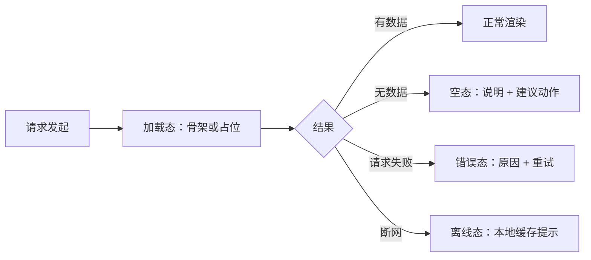
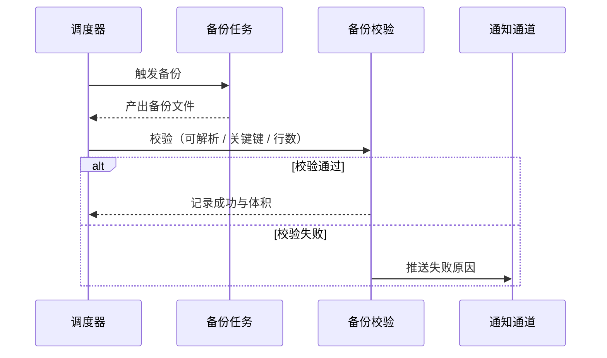

# 量化选股日历 — 产品需求文档 · 6.3.X 结构分治与体验一致性

- **版本**：6.3.X
- **阶段**：存量功能优化打磨（第三轮演进线）
- **前置**：6.2.3 已完成（前端设计系统打磨线收口，APP_VERSION 6.2.3）
- **状态**：待评审
- **编制日期**：2026-09-27
- **配套**：DEV&TEST-PLAN-6.3.X.md（开发与测试计划，独立文档）

---

## 1. 版本演进评估总览

### 1.1 演进背景

产品从 6.1.0 起进入存量打磨阶段。6.1.X 补齐了易用性、实用性、界面美观度、操作便捷性、运行效率、智能化与工程运维七条线；6.2.X 收敛了前端设计系统的结构与表达。两轮之后，用户可见的界面与交互已达到可用且一致的水准，剩下的问题集中在代码本身的组织方式。

盘点结果 [实测，2026-09-27]：

- 前端有 7 个源文件超过 1000 行，最大 `frontend/js/components/system-page.js` 1732 行，其后为 `research-page.js` 1608、`app-logic.js` 1444、`strategies-page.js` 1355、`watchlist.js` 1228、`ai-page.js` 1029、`shortterm-page.js` 1002。
- 后端有 3 个模块超过 850 行：`backend/ai_eval/_eval.py` 1161、`backend/scheduler/_core.py` 922、`backend/data_sources/_manager.py` 867。
- 后端存在 31 处 `except ...: pass`，分布在 20 个文件，其中 `factor_engine.py` 5 处（口径：`tests/test_silent_except_630.py` 的 AST 扫描，except 分支体仅一个 `pass`）。
- 前端 `research-page.js` 仍有 9 处原生 `alert` / `confirm`。
- 长列表虚拟滚动实际只落在 `ai-page.js`（7 处）与股票列表，研究与自选列表未覆盖。

这些状况带来三类直接代价：改动一个页面需要通读近两千行才能确认影响面；模块边界模糊，接手时找不到切入点；线上出现异常时没有日志线索，只能靠复现。

6.3.X 以结构分治为主线，把交互一致性、可靠性治理与效率守护作为配套批次推进。

### 1.2 七维度现状评估

| 维度 | 现状事实 | 判断 |
|---|---|---|
| 系统架构 | 后端 100 个顶层模块；前后端各有若干超大文件同时承载视图、状态与取数职责 | 边界可辨识，但核心文件已长成单体 |
| 软件设计 | 6.1.7 已引入域注册表（`frontend/js/state-registry-core.js`）与任务队列优先/去重；分层约定尚未落到全部页面 | 约定存在，执行不均 |
| 程序实现 | 后端 31 处静默吞异常；`print(` 仅剩 4 处（脚本类）；前端原生弹窗 9 处 | 局部有盲区，整体卫生度好 |
| 测试体系 | 345 个测试文件；CI 门禁覆盖体积、版本治理、令牌、对比度、虚拟滚动、热点 P95 | 门禁密集，但缺少「结构类」门禁 |
| UI/UX 设计 | 6.2.X 已收敛字体、字号、菜单、弹窗宽度、动效、玻璃与徽标 | 视觉一致性达标 |
| 用户体验 | 5 语 i18n；快捷键帮助、命令面板、右键菜单、会话恢复已具备；部分长列表与状态反馈不齐 | 主流程顺畅，边角仍不齐 |
| 运维保障 | `/health-detail`、数据新鲜度（`backend/freshness.py`）、备份校验（`backend/backup_verify.py`）均已具备；备份校验未接入调度 | 能力齐，联动缺 |

### 1.3 版本目标

沿用六项既定目标，本轮的着力点如下：

| 目标 | 6.3.X 着力点 |
|---|---|
| 易用性 | 状态反馈四态全站统一；原生弹窗清零，错误提示可读可关 |
| 实用性 | 异常不再静默丢失，出问题能查到原因 |
| 界面美观度 | 结构拆分不改变既有视觉，视觉回归门禁保持全绿 |
| 操作便捷性 | 长列表滚动流畅度对齐；新页面命令与右键菜单补齐 |
| 运行效率 | 拆分不增加净体积；热点接口 P95 与索引继续守门 |
| 智能化 | 收敛提升现有 AI 输出，本轮不新增 AI 能力 |

北极星判据：

1. 任意一个核心页面可以在单一文件内读完视图、状态与取数三段，不再需要跨 1700 行定位。
2. 后端不再有「无声失败」的代码路径，异常要么被明确忽略并注明原因，要么被记录。
3. 既有视觉与功能门禁全部保持绿，拆分前后对外行为无变化。

---

## 2. 行业实践参照

以下为业界通行做法，作为方案取舍的参照，不作为硬性标准。

**按职责切分长组件。** 前端社区普遍采用「容器负责取数与状态、展示负责渲染」的拆分方式，视图、状态、取数三段分离后，单文件规模通常控制在数百行。Vue 官方风格指南也建议单文件组件保持单一职责。

**渐进式拆分而非重写。** 对已经在跑的系统，主流做法是先建立行为基线，再逐步搬移代码，对外接口保持不变。这样每一步都可回滚，风险可控。

**不吞异常。** Python 官方日志指引与主流风格指南都明确：捕获异常后如果什么都不做，至少要留下记录或注释说明为何可以忽略。静默的 `except: pass` 是最难排查的一类缺陷来源。

**用门禁固化约定。** 团队约定如果不能被自动检查，就会随时间流失。既有的体积预算、版本治理、令牌门禁已经在做这件事，本轮把「文件规模」与「静默异常」也纳入同样的机制。

---

## 3. 需求全景与优先级

| # | 需求 | 维度 | 目标 | 批次 | 优先级 |
|---|---|---|---|---|---|
| H1 | 前端核心页面按域拆分 | 系统架构 | 效率 / 美观度 | 6.3.0 | P0 |
| H2 | 后端大模块拆分与导入兼容 | 系统架构 | 实用性 | 6.3.0 | P0 |
| H3 | 行为对拍基座推广 | 系统架构 / 测试 | 实用性 | 6.3.0 | P0 |
| I1 | 状态分层与归属清单 | 软件设计 | 实用性 | 6.3.0 | P1 |
| J1 | 静默异常分级治理 | 程序实现 | 实用性 | 6.3.0 | P0 |
| J2 | 日志口径统一 | 程序实现 | 运维保障 | 6.3.2 | P1 |
| K1 | 结构类门禁（文件规模 / 静默异常） | 测试体系 | 实用性 | 6.3.0 | P0 |
| K2 | 模块覆盖率门禁扩展到拆分产物 | 测试体系 | 实用性 | 6.3.1 | P1 |
| L1 | 原生弹窗清零 | UI/UX 设计 | 易用性 | 6.3.1 | P0 |
| L2 | 虚拟滚动覆盖推广 | UI/UX 设计 | 便捷性 / 效率 | 6.3.1 | P0 |
| L3 | 状态反馈四态全站一致 | UI/UX 设计 | 易用性 / 美观度 | 6.3.1 | P1 |
| M1 | 键盘与无障碍收尾 | 用户体验 | 便捷性 | 6.3.1 | P1 |
| M2 | i18n 硬编码收敛 | 用户体验 | 易用性 | 6.3.1 | P2 |
| M3 | 命令面板与右键菜单补齐 | 用户体验 | 便捷性 | 6.3.1 | P2 |
| N1 | 备份校验接入调度与告警 | 运维保障 | 实用性 | 6.3.2 | P0 |
| N2 | 健康与新鲜度联动告警 | 运维保障 | 实用性 | 6.3.2 | P1 |
| N3 | 日志轮转与磁盘守护复核 | 运维保障 | 运维保障 | 6.3.2 | P2 |
| O1 | 热点路径 P95 守门扩展 | 运行效率 | 运行效率 | 6.3.2 | P0 |
| O2 | 拆分后体积预算守门 | 运行效率 | 运行效率 | 6.3.2 | P1 |
| P1 | AI 输出结构化与降级路径统一 | 智能化 | 智能化 | 6.3.3 | P0 |
| P2 | AI 调用观测接入用量统计 | 智能化 | 智能化 | 6.3.3 | P1 |
| Q1 | 收尾：文档交接 / 双端回归 / 发布演练 | 全局 | 全部 | 6.3.3 | P0 |

批次顺序遵循一条原则：先把地基（H/J/K）打好，再做用户可感知的交互收尾（L/M），最后处理运维与效率（N/O）与智能化收敛（P）。

---

## 4. 需求详情：架构与实现

### H1 前端核心页面按域拆分

**现状**：`system-page.js` 1732 行、`research-page.js` 1608 行、`app-logic.js` 1444 行等 7 个文件各自承担了视图渲染、状态维护与接口取数三类职责。定位一处改动需要通读整个文件。

**目标**：把每个核心页面拆成「视图 / 状态 / 取数」三段，单文件规模回落到可通读的范围。拆分后页面行为、DOM 结构、样式与接口调用完全不变。

**范围**：7 个超千行文件。已在 6.1.7 完成拆分的 `app-logic.js` 域注册表作为范例沿用。

**边界**：不改变页面视觉；不改变接口契约；不引入新框架或新状态库；不顺手改业务逻辑。

**验收**：

- 拆分后的单文件行数上限达标（阈值在开发计划中给出）；
- 行为对拍结果与拆分前逐项一致（见 H3）；
- 视觉回归与功能回归门禁全绿；
- 前端构建成功，产物净体积增幅在预算内。

### H2 后端大模块拆分与导入兼容

**现状**：`ai_eval/_eval.py` 1161 行、`scheduler/_core.py` 922 行、`data_sources/_manager.py` 867 行。三者都是被多处引用的核心部件，直接拆分会影响调用方。

**目标**：按职责拆为子模块，同时保留原有导入路径可用，使调用方无需改动。

**验收**：

- 原导入路径仍可导入，且原有符号全部可见；
- 拆分后各文件规模达标；
- 对拍测试证实关键函数输入输出与拆分前一致；
- 全量后端回归绿。

### H3 行为对拍基座推广

**现状**：6.1.7 已建立一个轻量对拍门禁（`tests/test_behavior_parity_617.py`，17 项），用于验证状态域注册表与任务队列调度。它证明了「先固化行为、再动结构」这条路可行。

**目标**：把对拍从一次性用例升级为可复用的通用机制，覆盖所有被拆分的模块。

**能力要求**：

- 纯函数对拍：同一输入在拆分前后产出相同结果，逐项记录差异；
- 前端对拍：在 Node 环境下加载源码模块，比较关键导出函数的行为；
- 差异报告：对拍失败时输出具体差异点，而不是简单报错。

**验收**：每个被拆分的模块都有一份对拍用例，且在被拆分前先跑通一次。

### I1 状态分层与归属清单

**现状**：全局状态键数量已达数百，6.1.7 引入的域注册表把键按主题、认证、偏好、界面、页面五域声明。归属有了形式，但缺少一份明确的「什么状态该放哪一层」的口径。

**目标**：形成状态归属清单，明确三层职责：

| 层 | 存放内容 | 生命周期 | 持久化 |
|---|---|---|---|
| 会话层 | 登录态、当前用户、权限 | 登录期间 | 否 |
| 偏好层 | 主题、密度、详情展示模式、菜单形态 | 跨会话 | 本地存储 |
| 数据层 | 行情、池子、评估结果、任务状态 | 会话内 | 否（按需落盘） |

**边界**：本轮只做归属梳理与门禁，不做状态库替换。

**验收**：状态键全部可归入三层之一；不存在跨层写入（例如数据层直接写偏好层）。

---

## 5. 需求详情：测试体系

### K1 结构类门禁

**现状**：门禁覆盖了体积、版本、令牌、对比度、虚拟滚动、P95，但没有约束代码组织本身的规则，所以大文件与静默异常可以持续新增。

**新增两条门禁**：

1. 文件规模门禁：前端业务源码与后端模块的单文件行数上限；超限即失败，白名单需注明原因。
2. 静默异常门禁：新增 `except ...: pass` 为 0；白名单内的每一处必须带原因注释。

**验收**：两条门禁可运行、可阻断；白名单条目数有上限且逐条有注释。

### K2 模块覆盖率门禁扩展

**现状**：短线模块有 93% 覆盖率门禁，其余模块没有同类约束。结构拆分后文件变多，容易出现「拆出来的新文件没测到」。

**目标**：把覆盖率门禁扩展到本轮拆分产物，确保拆分不降低测试密度。

**验收**：拆分涉及的新模块纳入覆盖率统计并达到约定阈值。

---

## 6. 需求详情：界面与体验

### L1 原生弹窗清零

**现状**：`research-page.js` 中 9 处 `alert` / `confirm` / `prompt` 承担了错误提示与二次确认。原生弹窗样式与站内风格不一致，且无法在移动端良好呈现。

**目标**：全部迁移到站内统一的消息与确认组件，保持相同的触发时机与文案含义。

**验收**：前端业务源码中 `alert(` / `confirm(` / `prompt(` 出现次数为 0。

### L2 虚拟滚动覆盖推广

**现状**：6.1.5 建立了虚拟滚动覆盖门禁，实际落地集中在 AI 评估历史与股票列表。研究与自选等页面仍可能渲染数百行。

**目标**：对行数可能超过 200 的列表统一接入虚拟滚动。

**验收**：覆盖门禁升级为按页面清单逐项断言；滚动 500 行列表时帧率与首屏时间不劣化。

### L3 状态反馈四态一致

**现状**：站内已有统一的状态面板组件，支持加载 / 空 / 错误 / 离线四态。部分页面仍自行拼装文案，措辞与样式不齐。

**目标**：四态一律走统一组件；空态给出下一步动作建议，错误态给出可执行的原因与重试入口。

示意：

**验收**：空错态巡检门禁覆盖全部子页；不存在只有正常态的页面。

### M1 键盘与无障碍收尾

**现状**：快捷键帮助弹窗、列表 `tablist` 语义、部分 `aria-label` 已具备，仍有缺口。

**目标**：纯图标按钮全部有可读名称；列表具备角色与选中语义；焦点在明暗两套主题下均清晰可见。

**验收**：纯图标按钮缺 `aria-label` 的数量为 0；焦点环对比度达标。

### M2 i18n 硬编码收敛

**现状**：支持简体中文、英文、日文、韩文、繁体中文五种语言。新增文案中仍有硬编码中文。

**目标**：新增与改动的文案一律走翻译函数；五语文案键一一对应，无缺词。

**验收**：i18n 缺词守卫扩展后全绿。

### M3 命令面板与右键菜单补齐

**现状**：命令面板已有 40 余条命令，右键菜单已覆盖高频列表。本轮拆分与新增页面可能出现命令与菜单未同步。

**目标**：命令与菜单随页面变化同步，快捷键帮助文档一并更新。

**验收**：命令集中的每一项都能打开对应页面；不存在指向已移除页面的命令。

---

## 7. 需求详情：运维与效率

### N1 备份校验接入调度与告警

**现状**：备份校验函数已实现并有 6 项测试，但只在被显式调用时才运行，日常没有自动体检。

**目标**：把校验挂到定时调度，在每次备份产出后自动执行；校验失败进入通知通道。

**验收**：调度注册项存在；校验失败时通知被触发；系统状态页可看到最近一次校验时间与结果。

### N2 健康与新鲜度联动告警

**现状**：健康详情接口给出调度任务状态、数据源健康、备份最近成功时间与磁盘剩余；数据新鲜度接口给出每张表的来源与过期判断。两者各自展示，未与告警联动。

**目标**：数据过期与任务连续失败进入告警；系统状态页显示最近告警与处理状态。

**验收**：构造过期数据时告警被触发；面板可见告警记录。

### N3 日志轮转与磁盘守护复核

**现状**：审计日志已按日轮转且可配置。

**目标**：复核应用日志与任务日志的轮转是否覆盖；磁盘接近阈值时给出提示。

**验收**：轮转配置有测试守护；磁盘阈值提示可复现。

### O1 热点路径 P95 守门扩展

**现状**：6.1.5 建立了热点接口 P95 门禁，覆盖结构化评估、归因趋势与导入解析三条路径。

**目标**：把拆分后的新模块与新增热点纳入同一门禁；复核慢查询与索引命中。

**验收**：P95 门禁清单扩展且全绿；索引命中断言通过。

### O2 拆分后体积预算守门

**现状**：前端体积总预算为 1.4MB。

**目标**：结构拆分不带来净体积膨胀。

**验收**：构建后体积增量在约定范围内；预算门禁保持绿。

---

## 8. 需求详情：智能化收敛

### P1 AI 输出结构化与降级路径统一

**现状**：6.1.6 已实现评估输出结构化解析、纯文本回退、胜率模型推荐、晨晚报、问股上下文、入池出池归因趋势。各处的失败降级方式不统一：有的回退纯文本，有的静默留空。

**目标**：统一降级口径——结构化解析失败时回退纯文本并标注；无数据时明确说明缺少什么，不给出编造内容；事实护栏校验结果随输出一并呈现。

**边界**：本轮不新增 AI 能力，不引入新模型，不改变现有提示词策略。

**验收**：每条 AI 输出路径都有明确的降级行为并可测试；降级时用户能看到「为何降级」。

### P2 AI 调用观测接入用量统计

**现状**：用量统计页已存在，AI 调用的耗时与失败率未系统纳入。

**目标**：调用次数、耗时、失败率进入用量统计；异常比例偏高时在面板提示。

**验收**：用量统计可见三项指标；阈值提示可复现。

---

## 9. 用户与场景

**主要使用者**：个人投资者与量化研究者，单机部署，日常以只读浏览与筛选为主，偶发配置与批量操作。使用者对界面反馈的容忍度低——等待时要知道在加载，出错时要知道原因。

**次要使用者**：只读访客，权限受限，只能看到基础配置与关于页。

**维护者**：本人与协作的 AI 助手。这一角色决定了本轮的取舍：多人协作规范（分支策略、评审流程）不是重点，「可读性」与「可定位」才是重点——改动一个页面时能快速找到边界，出问题时能从日志定位到具体路径。

**核心场景**：

| 场景 | 触发 | 期望 |
|---|---|---|
| 改一个页面 | 需要调整某页交互 | 在一个文件内读完视图、状态、取数 |
| 定位一次异常 | 某功能结果不对或为空 | 日志中存在明确记录，能区分失败与无数据 |
| 排查数据滞后 | 发现行情或池子数据陈旧 | 面板直接显示过期表与最后成功时间，并有告警 |
| 长列表浏览 | 打开结果较多的列表 | 滚动流畅，首屏不卡顿 |
| 交接 | 隔一段时间回到项目 | 结构与文档能自解释，不必回溯记忆 |

---

## 10. 指标与度量

| 类别 | 指标 | 当前基线 | 目标 |
|---|---|---|---|
| 结构 | 前端超千行文件数 | 7 | 0 |
| 结构 | 后端超 850 行模块数 | 3 | 0 |
| 实现 | 静默吞异常处数 | 32 | 0（白名单除外，且需注明原因） |
| 实现 | 前端原生弹窗处数 | 9 | 0 |
| 体验 | 四态统一组件覆盖的子页比例 | 部分 | 100% |
| 体验 | 超 200 行列表的虚拟滚动覆盖率 | 部分 | 100% |
| 质量 | 行为对拍用例数 | 17 | 覆盖全部拆分模块 |
| 质量 | 门禁总数 | 现状基线 | 新增结构类与静默异常两类 |
| 体积 | 前端业务源码总量 | 预算 1.4MB | 增量不超过 3% |
| 可靠性 | 备份校验自动化比例 | 0（仅手动） | 每次备份后自动执行 |

度量口径统一由 CI 采集，人工核对以门禁输出为准。

---

## 11. 里程碑与依赖

| 批次 | 主题 | 覆盖需求 | 出口条件 |
|---|---|---|---|
| 6.3.0 | 结构分治基座 | H1 H2 H3 I1 J1 K1 | 拆分完成且行为对拍一致；结构类与静默异常门禁上线；全量回归绿 |
| 6.3.1 | 交互与体验一致性 | K2 L1 L2 L3 M1 M2 M3 | 原生弹窗清零；虚拟滚动与四态全覆盖；无障碍与 i18n 门禁绿 |
| 6.3.2 | 效率与可靠性 | J2 N1 N2 N3 O1 O2 | 备份校验接入调度并可告警；P95 与体积门禁绿 |
| 6.3.3 | 智能化收敛与收尾 | P1 P2 Q1 | 降级口径统一；文档与交接更新；双端冒烟与发布链演练通过；tag v6.3.3 |

依赖关系：

- H3（对拍基座）必须先于 H1 与 H2，否则拆分缺守护；
- K1 与 H1/H2 同批交付，先写门禁再动结构；
- N1 依赖既有的备份校验函数与调度器，两者均已在库；
- P1 依赖 6.1.6 已交付的结构化解析与护栏能力。

外部依赖：无新增第三方依赖。数据源凭据沿用现有配置。

---

## 12. 风险与应对

| 风险 | 可能性 | 影响 | 应对 |
|---|---|---|---|
| 拆分引入行为回归 | 中 | 高 | 先建对拍再拆分；每步可回滚；视觉与功能门禁全绿方合入 |
| 拆分使体积膨胀 | 中 | 低 | 体积预算门禁；超出即调整拆分粒度 |
| 异常等级误判（该暴露的被忽略） | 中 | 中 | 白名单每条需注明原因；新增门禁阻断未注明项 |
| 排期在拆分阶段膨胀 | 中 | 中 | 每批独立可发布，拆分批次不承载功能变更 |
| 虚拟滚动改造影响既有交互（行高变化导致点击错位） | 低 | 中 | 行高固定化并纳入门禁；改造后逐个页面回归 |
| 备份校验告警误报干扰 | 低 | 低 | 首期只告警不阻断；观察一轮后决定是否升级 |

---

## 13. 决策记录

2026-09-27 向导问卷四项确认，均采用推荐方案：

| # | 决策项 | 结论 |
|---|---|---|
| 1 | 主攻范围 | 以结构分治为主线，交互体验一致性与效率作为配套批次 |
| 2 | 重构深度 | 接受对超千行文件做「行为不变」的按域拆分，配行为对拍门禁 |
| 3 | 异常治理口径 | 分级治理（有意忽略需注明原因 / 可降级记警告 / 应暴露显式处理），并新增门禁阻断新增 |
| 4 | 智能化投入 | 收敛提升现有 AI 输出，本轮不新增 AI 能力 |

补充说明：版本编号沿用分批推进方式（6.3.0 至 6.3.3），最终以 v6.3.3 收口，与 6.1.X、6.2.X 的编号习惯保持一致。